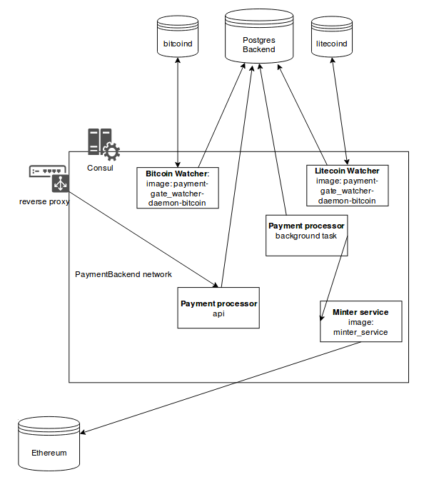


Authors: Algys Iyevlev, Aleksey Makeyev, Vyacheslav Melnikov, Sergey Prilutsky, Vladimir Khramov.

# Configuring, Launching and Interacting with Contracts: Constructors

The same smart contract may often be utilised to solve various business cases. With a simple case, parameters of the
constructor function for a smart contract vary from case to case; in more complicated cases, some code snippets may
be included into the resulting smart contract source code, whereas some are excluded. For instance, in a simple case, in ERC20 token the totalSupply
is set as the parameter for the constructor function (from this point on, we will interpret the "smart contract constructor"
as an engine provided and utilised on the Smartz platform). To avoid confusing it with a constructor in the sense
of object oriented programming, we will call the latter a "constructor function". In a more complicated case, a burn action may be
available in a token. This can be implemented by means of adding a correspondent feature into the contract code or through
inheritance: by means of connecting a token contract that has a Burn function (see "Burnable Token" in [erc20_token_constructor.py](https://github.com/smartzplatform/SDK/blob/ba8230d39e94f70a30e716f4f1e48ddd4e702432/constructor_examples/erc20_token_constructor.py)) as a parent contract).
This may require adding an additional logic that helps align the parent-class contract with the child-class contract.
(see `transfer`, `transferFrom`, `burn` in [SmartzToken](https://github.com/smartzplatform/sale/blob/6a00b30ccaa3dabc515ad7dfd29bbd85848c9603/contracts/SmartzToken.sol)).

After a smart contract is launched in blockchain, smart contract users must be provided with a DApp
that enables convenient interaction with the smart contract. Here we should consider some observations
described in the paragraph above: having passed a number of preliminary steps of various complexity, you will be able to use the same DApp across
multiple similar business cases. Besides, a simple DApp may be automatically generated on the basis of the smart contract.

We do not consider it to be economically viable to engage a developer to resolve each new case. On the other hand,
there's a kind of joke that says that "a real programmer must be lazy". This expresses the idea that the code
written by a good programmer is properly structured and convenient to use, which means that a programmer will spend less time
to complete a new similar task. Based on these assumptions, we have developed a concept of a smart contract
constructor. The underlying mechanism of a smart contract constructor implements exactly the ideas described above.

## Functioning of Smart Contract Constructors

There are three major parties that take part in configuring, launching and interacting with the smart contract: the developer
of the smart contract, user and Smartz platform. The developer arranges a smart contract in the form of a constructor and makes it
as reusable as he deems appropriate. The user launches the smart contract in blockchain,
interacts with it there and securely stores private keys of their blockchain accounts without ever
making the keys available to anyone else. The Smartz platform executes the constructor and all the auxiliary operations, thus simplifying development and
the use of smart contracts.

### Configuring and Launching a Smart Contract

#### Interaction between Smartz and the Smart Contract Constructor

A smart contract constructor (hereinafter: "constructor") is a source code written in any given programming
language (Python, javascript, Java, Perl, Ruby, PHP etc.) with a defined programming interface.
Interaction with Smartz represents a call for any methods by the platform.

The constructor code (and thus the generated contract codes) is an open-source code, which makes it possible to audit the code. Before execution,
a necessary compilation occurs as well as caching of the obtained output (e.g. in the case of Java we obtain a .class file; in the case of Python — 
a .pyc file).

Low-level interaction with the constructor occurs within a dedicated constructor service, and its logic is described below.
If you need to call a constructor method, the platform will execute the compiled constructor
code in a siloed Docker container. Memory usage, process count, process runtime and interaction with the drive subsystem and network are restricted in the container. A constructor file and library that provides
access to internal API Smartz are assembled into the container. Creating such a container is quite a resource-intensive operation (appr. 1–2
seconds), so containers are normally reused. The statistical part of the constructor service that is executed in the container
loads a particular constructor using the mechanics of the related language (e.g., in the case of Java this is ClassLoader and in the case of
Python, this is importlib) and calls the required method after sending parameters as call arguments. The execution result is returned
to the constructor service.

#### Input Data for the Constructor

The constructor describes the input data that it expects the user to provide.
This data may be numerical values, strings, blockchain addresses or even more complicated data (e.g. collections and structures). Besides,
it's recommended to apply restrictions to the data (e.g. set maximum number of signatures in the multi-signed contract), so that
users can adjust the data even in the interface and developers don't have to repeatedly
implement data validation logic. We call this description the "data scheme".

For the purposes of describing the scheme, we use ready-to-use near-standard solutions intended for any given domain. This
may provide the following advantages:
* Some developers are already aware of them. Those who are not may reuse the knowledge gained while working on
other projects.
* There are ready-to-use tools and libraries which can be used, for instance, in validating and generating interfaces.

Smartz is going to support the following formats of input data description [json schema](http://json-schema.org) and
[OpenAPI Specification](https://swagger.io/specification/) (used in [swagger](https://swagger.io/)). Besides,
Smartz provides ready-to-use descriptions for some data types, e.g., Ethereum address or unix timestamp in terms of
suitable schemes.

Similarly, the constructor's data schema may be optionally complemented with a display scheme (`ui_schema`), which impacts rendering
of the data input interface.

When a user wants to configure and launch a smart contract, they go to the appropriate Smartz page.
From this page, they send an RPC query to the platform, and the platform gets the data scheme and the display scheme for the particular constructor by means of
calling the constructor's `get_params` API. The schemes are sent via the platform back to the client browser where
they are processed by the Smartz client code. Based on the data and display scheme, a user interface is automatically generated for
configuring the constructor (using a [react jsonschema form](https://github.com/mozilla-services/react-jsonschema-form) component).
In this interface, the most convenient widgets are rendered for each particular type
(e.g., unix timestamp — a calendar that supports specifying date and time, an address book for blockchain addresses).
When a user sends the form with parameters to the constructor, they are first quickly validated for their consistency
with the front-end data scheme, and incorrectly completed fields are highlighted as required. If the data pass the validation successfully,
they are then sent to Smartz.

#### Generating and Compiling a Smart Contract

On the back-end side, Smartz gets input data for the constructor and first validates their compliance with the data
scheme. If errors are found, the error information is sent back to the client with a drilldown for each field
(using [python module for working with json schema](https://github.com/Julian/jsonschema)).
If no errors are found, input data are sent to the "construct" call.

It's assumed that the constructor first performs an additional, more complicated validation. For instance, in case of a multisig wallet
there's an obvious condition saying that the number of owners may not be less than the signature quorum. It does not seem viable
to implement such a condition at data scheme level. Such validation may result either in a generic
error that is not specific for any particular field (as in the above example) or an error that is related to a
specific field. Both cases are included in an appropriate API response, returned to Smartz and subsequently sent to the client
where it is rendered.

Then the smart contract code is generated. Generation setup is the responsibility of the constructor developers, who are free to select their own approach. Smartz will provide a library to simplify generation and
increase its reliability. For instance, it will contain methods for secure value substitution in a smart contract template (if
no substitution occurs, this is automatically perceived as an error, most probably a misprint), and
for verification to check whether all substitutions are properly made. Besides, Smartz will provide a set of well-known template engines.
(e.g. [Mustache](https://mustache.github.io), [Jinja](http://jinja.pocoo.org), [Thymeleaf](https://www.thymeleaf.org), etc.).

In addition to generation performed by the constructor, Smartz adds to the source code instructions for sending a fee for
launching a contract to the developer and the platform.

The generated output is a source code for a smart contract written in any defined language (e.g., solidity). Then the source code is
sent to the compilation infrastructure. This is a dedicated service that uses a set of containers to compile
the code for a smart contract using the appropriate version of the corresponding language (e.g., C++ with the Solc compiler version is used for Ethereum).
All other things equal, we have to use the most accessible and stable version of the language.
Along with that, a higher degree of isolation is achieved from other parts of the platform.

If compilation errors occur, the compilation service returns a standard compiler's output stream that is saved in
the Smartz storage. At the same time, we perform deduplication and compression to the records related to the same constructor because
the chances are that there's a significant amount of duplication across the records. The developer will be notified of the compilation
issues via a notification engine, since compilation errors are no regular situation. Any user
input errors must be managed and prevented at the constructor stage, and after that the data and code
must be harmonised.

In the case of successful compilation, we get a binary code (e.g. EVM bytecode, web assembly etc.) and
an interface (e.g. ABI) which are sent to the user's browser via Smartz.

Along with that, the constructor's post-construct method is called where the input data are sent (the same data that were sent
to the construct) together with the resulting smart contract interface. Based on these parameters, the constructor is able to enrich
the standard DApp that is generated by the platform with the additional data (see below). At this step, the
"instance" is shaped as part of the platform, and the contract's source code, binary code, interface and
additional information for DApp are included in its description.

#### Uploading a Smart Contract into Blockchain

After the compilation step, the user has the option of uploading the resulting smart contract into blockchain in the Smartz interface.
The entire upload procedure is performed on the user side by means of interaction with blockchain in the browser. In case of
the Ethereum network, any browser may be used that manages user accounts and provides the
[web3](https://github.com/ethereum/wiki/wiki/JavaScript-API) interface (e.g. Chrome and similar browsers with
[MetaMask](https://metamask.io) or [Mist](https://github.com/ethereum/mist) extension). In case of EOS, you can use any
browser that manages user accounts and provides the [eosjs](https://github.com/EOSIO/eosjs) interface.

Smartz creates and tries to send a contract upload transaction to the network. At the same time, the browser asks the user to
sign the transaction and specify information about fees charged by the network, developer's fees and Smartz platform-related fees. After the transaction is signed,
it is sent to the network, and Smartz expects miners to include it into the blockchain.  When the transaction is included intothe blockchain,
the platform registers the required blockchain-related information in an instance of the constructor (e.g. blockchain address of the contract and ID of the network,
to which the contract was uploaded).

After successfully uploading the contract, Smartz is going to automatically verify the contract code in the background on specialised block
explorers (e.g. [etherscan](https://etherscan.io)) unless the user has explicitly forbidden this action.

The user receives the contract's blockchain address and a link to the DApp, and the instance is added into the list of user instances.

### Interacting with Smart Contracts

On the page of the contract instance, Smartz builds the DApp GUI based on the following:
* blockchain parameters of the contract instance
* blockchain interface of the contract instance
* additional information provided in the `post_construct` call, like:
- user-friendly names and descriptions for the functions, their parameters and returned values
- refined types of parameters and returned values, e.g.:
- date & time type for unix timestamp that is actually stored as a plain number and represented as such in standard DApp interfaces
- hash-file type
- etc.
- management of sorting order and grouping of elements

First of all, the interface contains general information about the contract: instance name, address, balance, owners (where
applicable to any given blockchain).

#### Functions Providing Interaction with Smart Contracts

The core building blocks for an interface are the functions (or methods) of the contract. Platform functions are divided into three
core groups: contract poll functions (read-only) without parameters, contract poll functions with parameters and functions to
send transactions to the contract. The output of poll functions is only relevant for the block that was
the last block in a basic chain at the moment of executing the function. Any interaction with the contract is performed via
an appropriate blockchain interface that is provided by the client browser (see above).

Contract poll functions without parameters are used at the same time — each of them is called simultaneously along with getting and
rendering the call output. Besides, the developer attributes some of them to the instance
dashboard. The instance dashboard is displayed in the first turn, including displaying on the summary pages of the user instances.

Contract poll functions with parameters may be called via the appropriate control widget after the user
enters the required parameters. The output is obtained asynchronously via a blockchain poll; however, you don't have to create
a transaction and wait until it is accepted by blockchain. As such, users call this function free of charge.

Functions to send transactions to the contract make it possible to create a transaction and normally modify the state of the contract and
blockchain. After the user enters the call parameters, Smartz creates a transaction and offers the user the option to
sign it. A network token (currency) may also be sent within the transaction(e.g. Ether), and this may require withdrawing the contract developer's
fee, if the developer enabled a monetisation option. After the transaction is signed by the user,
it is sent to blockchain, and the platform waits asynchronously until the transaction is accepted by blockchain. When this happens,
the user is informed in the instance interface.

#### Parameters of the Functions, Widgets

To create a rich DApp interface, you should be able to bring a description for any given input or output parameter
of the function as close as possible to the concrete area where this smart contract operates. For example, from the point of view of blockchain,
a parameter for two various contract functions may be an integer (e.g. `unit256` in Ethereum). As such, 
these functions will be using the same DApp interface, and this interface will be quite poor: it's only going to be a field where the numerical value is entered. However, in some cases,
the date and time may actually be saved as a numerical value (unix timestamp), and in other cases the amount in Ethers is specified in wei.
Having this information, Smartz may in some cases render a calendar widget instead of a field for entering a numeric value, and in other cases it may render a convenient
widget for entering the amount in Ethers without specifying a huge number of wei and which makes it possible to enter an amount in
USD.

Description of the input parameters for the functions may be provided by the constructor developers via the data scheme with its core element
being either an array or an object (if the parameters named are supported in the interface of specific blockchain).
To describe the schemas, the same technologies are used as those for describing user input data when designing
the smart contract. With that, the platform determines ready-to-use data types — blockchain addresses, date and time, amount of
cryptocurrency, hash-strings, file hash, etc. For each function, Smartz renders a control widget
based on the scheme of the function's input parameters, using [react jsonschema form](https://github.com/mozilla-services/react-jsonschema-form) as a basis.
When the user enters parameters, they are validated for compliance with the scheme, and after that they
are converted to the format of a specific blockchain. For instance, when using a web3 library, you should save numerical values in Ethereum blockchain
as instances of [BigNumber](http://mikemcl.github.io/bignumber.js/). Retrieved values
are sent to the code that shapes the transaction.

The output of the functions may also be complemented with the data scheme. Here all the same techniques are applied as described above, but
in the reverse sequence. First of all, data are decoded from the blockchain format. Then, based on the schema
provided by the constructor developer, the value is rendered in the most user-friendly way.


## SDK

A software development kit (SDK) is available at https://github.com/smartzplatform/SDK. It includes API documentation,
data schemes, launch and debugging tools for constructors and ready samples of constructor code.

API documentation contains a complete description of the platform interface that enables interaction with the constructor
for all supported languages used to develop constructors. The constructor interface is the key interface, e.g.:
[for Python](https://github.com/smartzplatform/SDK/blob/ba8230d39e94f70a30e716f4f1e48ddd4e702432/api/smartz/api/constructor_engine.py).

In previous sections, we mentioned that Smartz provides some ready-to-use data types that may be utilised in data
schems (e.g. blockchain addresses and unix timestamp). All of these are available in the SDK. For instance, the following definitions are available for Ethereum as a json scheme:

```javascript
{
"$schema": "http://json-schema.org/draft-04/schema#",
"definitions": {
"address": {
"type": "string",
"pattern": "^(?:0[Xx])?[0-9a-fA-F]{40}$"
},

"addressArray": {
"type": "array",
"items": { "$ref": "#/definitions/address" }
},

"unixTime": {
"type": "integer",
"minimum": 1,
"maximum": 2147483647
}
// ...
```

Developers value the speed of developing and debugging code. For this reason, Smartz SDK provides tools for a fast launch and 
tools for debugging on the local developer's machine without having to load constructors to Smartz.
For instance, you can check the data scheme being created with the help of the console command:

```bash
./SDK/bin/run-constructor.py get_params smartz/backend/constructor_examples/SMRDistributionVault.py
```

And you can use the following console command to call the constructor and retrieve the smart contract code:

```bash
./SDK/bin/run-constructor.py construct --fields-file fields.json smartz/backend/constructor_examples/SMRDistributionVault.py
```

Moreover, you can check the automatically generated DApp interface based on the smart contract interface:
the rest of the data will be retrieved from the constructor.

The local environment on the developer's machine cannot fully comply with the Smartz environment, so the next,
final step of debugging will be to load and launch the contract in a Smartz test environment that fully
complies with the working environment; the only difference is that the loaded constructors won't be available to other platform users.

Support of the development tool will be integrated as a plug-in into the most popular IDE.

A large portion of the constructors developed by the Smartz team will be represented by examples illustrating the use
of the platform and the best development practices [see here](https://github.com/smartzplatform/SDK/tree/ba8230d39e94f70a30e716f4f1e48ddd4e702432/constructor_examples).


## API

Platform users may access Smartz not only from a browser. The following API will be available.
1. In this way, we make the `get_params` API call available and retrieve the constructor's parameters.
2. By means of the `construct` API call, you can call the constructor and retrieve the binary code for the contract along with other information.
Then you should create and sign a contract creation transaction with a private key that is still stored
on the client side.
3. The retrieved signed transaction must be sent to the network with the help of the `broadcast_tx` call that sets
optimal fee values depending on the transaction amount and the task urgency.

Steps 2 and 3 will be combined within a single service that is provided to the customer either as source codes assembled with the help of
[docker](https://www.docker.com), or as a docker image, depending on the customer's selection. Therefore, the service does not require the customer
to trust Smartz and is entirely controllable by the customer. The service has access to
private keys that are stored either in nodes of appropriate blockchains or in [HashiCorp Vault](https://www.vaultproject.io).
The service provides asynchronous API for a single-step solution of the final task: uploading the right contract with the specified
parameters into blockchain. The customer's IT pros do not have to be advanced users of blockchain or any specific technology used to support
the infrastructure of relevant blockchains — it's enough just to be able to create and securely store the private keys and to work
with the classic REST API. Using docker makes it possible to virtually deploy solutions in any customer infrastructure, including
clouds.
Use of the service is not mandatory and is left to the customer's discretion.

Similarly, you can sign a transaction for the role specified in the constructor instance and
send it via `broadcast_tx` or via the service.

A list of client-launched instances will also be accessible through API.


## Integration with Github

A typical part of the smart contract development infrastructure is a separate repository at [Github](https://github.com) which contains
source code frin the contract split into multiple files, list of smart contract dependencies, autotests, etc.
Normally, the smart contract constructor can not be retrieved automatically from any of the above, if only because
it contains a lot of extra information.

We expect the smart contract constructor to reside in
the "Smartz" subdirectory in the smart contract repository. We also expect it to contain the developer's public Smartz API key,
a human-friendly name and description of the constructor as well as the logo, images and other auxiliary materials.
In this case, Smartz will be able to automatically upload the constructor to the platform as a pre-release version, if the developer specifies the URL of their
repository containing the contract.

Smartz is also able to monitor new releases in the contract repository using the public Github API. A pre-release may be created
on the platform for each release with the release description added as extra information.

You can also work with private repositories when you're granted read access for them.

Pre-releases on Smartz become available to the general public via moderation. They may be sent to moderation either automatically
or manually, on the developer's request. It is not necessarily advisable to always select automated sending
because moderation implies a number of restrictions for query frequency and the code audit is for a fee.


## Integration with Travis CI

The smart contract development infrastructure also contains continuous integration services
(CI), like [Travis CI](https://travis-ci.org). Github + Travis CI combination is also quite typical. Autotests are
automatically executed for new changes made to the source code, and the results of the automated test of
the changes become clear. If Travis CI or other continuous integration systems are connected, then only the changes that
have successfully passed autotests may be uploaded to Smartz as pre-releases.

You will also be able to configure the pre-release based on the outcomes of successful project assembly within the continuous integration
system. The process strongly resembles the one described in the previous section: you will need the constructor, name, description and other
materials as well as the developer's private Smartz API key. Whatever is required will be included into a single package and sent to
Smartz. Smartz provides a script that enables executing the specified actions with a single command, including as a docker image.


## Contract Systems

Just as the programs written with the use of OOP consist of multiple interoperable classes, so do advanced
blockchain applications also consist of multiple interoperable contracts. We call it a contract system. A typical
example is an ICO contract system where there is one or more crowdsale contracts containing the price calculation
logic and similar, token contract and storage contract to store raised funds which enables participants to get
their money back if the project does not reach its soft cap.

Until now, we have viewed the smart contract source code as a kind of atomic and a simultaneously self-contained unit,
but contract systems require some additional actions from the platform while compiling and uploading to a blockchain.

In the event of a system of contracts, the constructor is represented by an archive (tag.gz, zip, jar etc.) containing
whatever is required to provide the platform with the source code of smart contracts adapted according to a specific user query. In most cases, it will be the source code templates for the contracts together with the constructor logic packaged in separate files and
a migration file (see below).

The user query is processed within the platform in the following way.
The constructor service unpacks the archive in a siloed docker environment.
Depending upon the language used for writing the constructor, the archive may contain an entry point (e.g. a
constructor.py file executed by the platform). It receives input data just as it happens with a
single contract. Details of the constructor service have already been given above.

It is presumed that the constructor performs all actions necessary to prepare the code: substitution of the retrieved values
into configuration files, running of the template engines, etc. As a result, the constructor must send a set of the source code
artifacts to the platform. Each artifact has a name and contains a link to the file in the directory that needs to be compiled
in order to get a binary artifact representation.

Then the constructor service sends the directory and artifact-related information to the compilation service where a binary representation is available for
each artifact. The compilation details have been given above.

Then you should send the retrieved artifacts to user browser and launch contracts in blockchain.

### Uploading a Smart Contract System to a Blockchain

The most delicate thing about supporting contract systems is uploading the system to a blockchain. This
is conditioned firstly by the requirement related to contract binding and secondly by restrictions imposed on the
transactions by blockchains (e.g., gas limit in Ethereum block). It's not enough to simply upload a sequence of contracts to a blockchain;
you must also set proper bindings for them. Binding may be set both during the upload of a specific contract using the constructor
function arguments and after that by sending transactions (e.g. calls of setters).
This process is normally described using "migrations," and to describe it properly a certain expressivity of the common programming language
is advisable (e.g. in [truffle framework](http://truffleframework.com) migrations are written in javascript).

In Smartz, migrations will be written in a special declarative language that is created specifically for this task (DSL).
This is done mostly in order to provide security for users and platform. Although the constructors undergo
an audit, we still consider it unsafe and premature to provide migrations with direct access to blockchain APIs (e.g. web3)
and blockchain user accounts, even if every action requires explicit user confirmation.
In the future, these restrictions may be eliminated or at least softened after properly thorough development. Migrations written in javascript may
be accepted for specific contracts as required, but only after they pass a comprehensive audit.

The language of migrations will contain the following primitives:

* Uploading a previously retrieved artifact into a blockchain.
* Calling a specified function of one of the uploaded artifacts.
* Constants, data retrieved from users and addresses of already uploaded artifacts may
become call arguments (incl. contract constructor functions).
* Opportunity to specify a user-friendly description of the current step.

Artifacts, user input data and the migration handler will be uploaded to the client's browser.
The migration language will be interpreted by the platform code and perform the required action using blockchain APIs and
the data listed above.

For instance, we get the following migration for the above-mentioned ICO contract system:

```c++
token = deploy('Token', fields.owners);
funds = deploy('FundsRegistry', fields.owners);

sale = deploy('Crowdsale', fields.owners, token.address, funds.address);

token.transact('setController', sale.address);
funds.transact('setController', sale.address);
```

### Cross-chain Contract Systems

Cross-chain contract systems are a set of contracts that reside in various blockchains, but
are interoperable. The interoperability may be direct (e.g. using block relay or
para-chains (for instance, see [Polkadot](https://medium.com/polkadot-network/polkadot-the-parachain-3808040a769a)),
or orchestrated using DApp (for instance see [POA Bridge UI](https://bridge.poa.net)). A typical example
of a cross-chain contract system may be an atomic swap that contains two contracts, one per
blockchain.

To support cross-chain contract systems, Smartz modifies this approach in the following way: first,
a constructor for each artifact notifies to which blockchain it belongs. The compilation service uses this knowledge to
call the appropriate compilation infrastructure. An example of such output from a constructor in case of an atomic swap is
given below:


```json
{
"EthereumSide": {
"file": "ethereum/contracts/AtomicSwap.sol",
"blockchain": "ethereum"
},

"EOSSide": {
"file": "EOS/src/AtomicSwap.cpp",
"blockchain": "EOS"
}
}
```

Second, while uploading a smart contract system to blockchains, the contract upload directive for the migration language
automatically gets the blockchain from the artifact description to which it should upload the contract. With that, the parameters
of the function call (i.e. contract addresses) are still available for any blockchain for executing the contract connections
(if setting a direct connection between contracts is required, see above). Therefore, the migration script in this case
is fairly simple:

```c++
deploy('EthereumSide');
deploy('EOSSide');
```

Again, you will be able to establish parameters for the blockchain to which the contract is uploaded, by creating a blockchain specification. For instance,
the Ethereum code base supports blockchains with a different network_id parameter (network_id = 1 — main network, network_id = 4 —
test rinkeby network), and there are Ethereum forks that use this engine, e.g., network_id = 99 — Core,
the main public blockchain [POA Network](https://poa.network). If a bridge between two Ethereum-like
blockchains is loaded, we get the following migration:

```c++
EthereumMainnet = define_network('Ethereum', network_id=1);
POACore = define_network('Ethereum', network_id=99);

deploy('ForeignBridge', network=EthereumMainnet);
deploy('HomeBridge', network=POACore);
```


# Contract Management

The basic mechanics of contract management are described in the "Interaction with Smart Contracts" section. Here we are going to focus on
the additional benefits that Smartz provides.

## Custom DApps

In a simple case, the user interface of a constructor instance is generated automatically based on the programming
interface and additional prompts from the developer; this process is described above. This may be insufficient to provide a rich
and convenient DApp. Smartz provides developers with the opportunity to upload and provide a fully-fledged
DApp UI based on javascript or TypeScript. This approach gives maximum freedom
to developers, even though it requires special attention at the audit stage. We do not consider it advisable
to be complacent with half-complete measures (e.g. designing an intermediate abstraction that is a limited set of
overridden graphic primitives and operations) because this will ultimately require more effort and will most likely fail to solve the initial
task.

Support will be added for DApp user interfaces implemented as SPA (Single Page Application), including
those that use react, Angular, Vue.js frameworks.

Each constructor will only be able to have a single DApp because there's no need
to use any code generation mechanisms at this step. Instead, when launching a custom DApp, the platform will send
the following parameters to it:

* user input data for constructor (if applicable, see Custom DApp Marketplace below)
* contract "coordinates": blockchain specifications (see "Crosschain Contract Systems"), contract address
* contract interface(s)

Based on this data, the custom DApp will be able to properly customise the user interface.

Custom DApp must be presented with the draft source codes and the necessary resources. An audit will be performed for it before
publication. To ensure security, a whitelist of dependencies will be added that may be used for the project.
To ensure reliability, the required version of dependencies will be cached on the Smartz servers and
used if the main source of code (e.g., npm repository or individual packages) becomes unavailable or
compromised.

Spoofing of packages in the npm repository has already taken place as well as deployment of
[malicious packages](https://www.twilio.com/blog/2017/08/find-projects-infected-by-malicious-npm-packages.html).
Many accounts that are used to download npm packages are [poorly protected](https://www.bleepingcomputer.com/news/security/52-percent-of-all-javascript-npm-packages-could-have-been-hacked-via-weak-credentials/).
In addition to the whitelists mentioned above, an integrity control engine will be used in order to protect DApp integrity and eliminate the requirement
to trust the Smartz platform.

1. The developer must use package-lock.json (in addition to integrity control, this will also ensure a stable-functioning, repeatable application).
2. At the time of DApp interface assembly, integrity control is applied to all dependencies via npm engine.
`Standard Subresource Integrity`. Then the hash is computed for an assembled application.
3. Integrity control code is executed at the time of launching on the user's side. This is an open, non-minified compact
code, and its integrity may be checked by means of the hashing process. Integrity control code compares hash applications
and publishes it together with its [identicon](https://en.wikipedia.org/wiki/Identicon).

To prevent custom DApps from impacting each other or the platform, they will be placed into different Smartz subdomains
which are unique for each constructor instance.

Static resources (e.g. images and CSS) should be placed into a "static" subdirectory; they will be automatically
placed onto Smartz servers and made available in the DApp interface with an appropriate filepath that starts with `/static/`.


## Local DApps

In order to completely eliminate user dependency from Smartz platform, the interface of any user-launched DApp or any DApp accessible
to the user may be later downloaded from the platform and saved locally
in a fully operational state (there's no point in saving the other DApp component — contracts because they're executed in relevant
blockchains).

The local copy is an archive that contains javascript or TypeScript logic and resources. It may run in any
browser or application that provides interfaces for the relevant blockchains (web3.js, eosjs etc.).

The platform will also be able to issue a `package-lock` for a DApp interface and its source code,
so that the user can independently assemble the interface, thus eliminating the need to trust Smartz
and enabling a complete DApp audit to identify bookmarks or unwanted logic before launching.

Local DApps will be available both to the interfaces that are automatically generated by the platform and to custom DApps.

Local DApps implementation on the platform side nearly mirrors the DApps running in web mode. In both modes, DApp
consists of resources, a static part (which does not change from instance to instance): this may be a part of the platform code
(for automatically generated interfaces) or the DApp developer code (for custom DApps) and a dynamic part (this
includes user input data, contract "coordinates, contract interfaces).

In one instance, the static part may be published on the web, and in the other instance it is archived. As concerns web DApp,
the dynamic part is included in a webpage of constructor instance; for the local DApp, it is saved as json in a javascript file and
connected to the DApp.

Local DApps are provided with integrity control mechanisms described in the previous section.


## Control Panels

Custom DApps are not closely connected with the specific constructor instance, but rather adapted dynamically
based on the information about the instance (see Custom DApps), and interfaces and smart contract code may be open-source. Owing to these factors, 
the developer has an opportunity to develop DApp interfaces for the contracts created by other developers.

This dedicated platform-based constructor type is called a dashboard, and it functions in the following way.

The platform calls gt_params and renders an interface for user input data. User input is validated.

No smart contracts are compiled at this step; instead, a `post_construct` method is invoked. The method must provide
coordinates for the contract to be managed by this dashboard instance.

The further mechanics are similar to those previously described. The platform assembles a DApp interface, and in the case of a web interface, the platform
adds the required data stored in Smartz (contract coordinates etc). In the case of a local DApp, the assembled
application and user input data will be output as an archive.


## Custom DApp Marketplace

Dashboards will also receive a dedicated marketplace that is similar to the marketplace for constructors. Developers may create
DApp interfaces for the contracts created by other developers.

There are many examples of these dashboards:

* A dashboard for managing specific popular tokens. It is basically an opportunity to create a "better" wallet
that is specific for any given token and based on its mechanics that otherwise can't be obtained through the ERC20 interface. Such a
dashboard will certainly contain information about token contract coordinates.
* Dashboard for ERC20 tokens. It is more convenient and information-rich than a traditional Mist interface.


## Contract System Management

The concept of contract system management is not significantly different from managing an individual contract as described above.
As concerns automatically generated interfaces, they are generated for each specific contract in the system. Besides,
the platform provides an opportunity to specify the sequence of interfaces constituting the systems and the structure of a general dashboard
for the system. In the case of a custom DApp, the application can access all the required data (user data, input data, coordinates
of the contracts etc.), and the author of the DApp may freely arrange the interface in the system.

Transactions may be sent to an appropriate contract in the appropriate blockchain by means of a relevant client library, using
the blockchain parameters, address and contract interface.


# Platform

In addition to providing the previously described functions of design and DApp management, the platform is a rich web portal.

## Authentication

A number of various user authentication methods will be supported.

**Signature-based private key authentication**. This is a version of a challenge-response protocol. The platform generates
a unique message that says that the message was created for the purposes of authentication on Smartz and contains
user address and current time. The platform interface gives the option of signing the message
with a private key within a specified period of time and sends it for verification to Smartz. The signature is verified using a user's public key.
For the signature, for instance, you can use 
[message signing in MetaMask](https://medium.com/metamask/the-new-secure-way-to-sign-data-in-your-browser-6af9dd2a1527).

**OAuth2-based authentication**. Social authentication providers will be used, like Facebook,
Github, Google+.

**Conventional password-based authentication**. Hashed passwords are stored in the database with an additional
random parameter (so-called "salt") in order to prevent brute-force attacks.

However, if a single user performs authentication using various methods, this will not create multiple
accounts on the platform. Instead, a function is added that enables linking new authentication methods to the account.

Administrators will have access to the "Login As" feature that enables obtaining read access on behalf of any other account
to troubleshoot user issues.

Optional support of two-factor authentication is provided via Google Authenticator.


## Notification Engine

An internal `notify(user, subject, message)` engine will be implemented.

The user will be able to setup notifications display (in the platform interface, by email, in Telegram) in their profile. This engine will be
used by various Smartz subsystems.


## Key Entities

### Groups

Rights management within the platform is performed by means of the following groups:

* administrators
* developers
* partners (integrators)
* developer moderators
* contract moderators
* partner moderators

### Constructor

Constructors are created by developers. Key functions — creation, state modification, viewing.

Constructor states:
* draft
* under moderation
* published
* archived
* blocked

Users can see the constructor only when its state is "published". Author can see it regardless of the state.

Author may perform the following state modifications:

* draft -> moderated, archived
* published -> archived

Constructor fields include "tags" — single-word, phrases (less commonly), constructor specifications
provided by the author that users may use to perform a highly relevant constructor search, e.g.: multisig,
token. Tag input interface is a typical tag input string containing prompts. Prompts will be
implemented by means of
[AnalyzingInfixSuggester](https://lucene.apache.org/core/7_2_1/suggest/org/apache/lucene/search/suggest/analyzing/AnalyzingInfixSuggester.html).
Sorting — based on usage (input into constructors) frequency.

### Constructor Instance

Stores information about the constructor launched, the users that launched it, constructor details (parameters,
obtained interfaces etc.), contract coordinates.

### Constructor Launch Statistics

Registers any launch of a constructor in blockchain. Contains constructor instances and information about
the rewards paid to platform and developer.


## Moderation

There are three moderated entities: developers, constructors, partners. They all share a single behaviour.

* There exist some applications for moderation (e.g. knowing that a user wants to become a developer or knowing that
a new constructor has been sent for publication).

* There's an interface containing the list of applications where general information is displayed for each application. In the case of large amounts of information, a link to drilldown data is provided that uploads
additional information directly to the page.
* The ability to accept or decline the application using available buttons ensures synchronisation between moderators.
In this case, the list displays only the applications declined. Administrators get the opportunity to cancel acceptance of
applications for the specified moderator.

* List of applications is sorted based on the criteria specific for each entity.

* Moderators may approve or decline applications (and specify the reason for their choice). In case the application is declined, a notification
is sent to the appropriate user.

There's also individual working logic:

* Creating an application

* For developer moderation — if a user specified in their profile that they want to become a developer
* For partner moderation — if a user specified in their profile that they want to be a partner
* For constructor creation — if an author selected "Publish Constructor"

* Sort applications in the list 

* For developer moderation — older first
* For partner moderation — older first
* For constructor creation — by business function rating

* Application approval

* For developer moderation — flagged, notification sent
* For partner moderation — flagged, notification sent
* For construction creation — state modified, notification sent


## Marketplace

### List of constructors

Within the platform, a single logic exists that handles the request for the list of constructors. It performs:
* filtering by developer
* filtering by tags
* filtering by status and audit pattern
* page-by-page iteration

**Common list of constructors**. Intended for users. Displays only constructors with the
"Published" status provided only by non-blocked developers. Filters: tags, word occurrences (full-text search by
name and description). Page-by-page iteration.

**User: developer information page**. Developer page as seen by users. List
of constructors filtered by a specific developer, filter by tag, page-by-page iteration. The filter only displays
constructors that have passed moderation.

**Developer: developer information page**. Developer page as seen by developer. List
of constructors filtered by a specific developer, filter by tag, page-by-page iteration, controls
for constructors.

**User: list of constructors launched by this user**. List of launched constructors sorted by date, with
page-by-page iteration and links.

### Statistics

**User statistics**. Statistics of launches performed by a specific user.
Summary statistics for constructors (constructor => (launches, money)).
Summary statistics by month (month => (constructor => (launches, money))).
Each number of launches is expandable into the list of launches.

**Developer statistics**. Statistics of launches for constructors created by a specific developer.
Summary statistics for constructors (constructor => (launches, money)).
Summary statistics by month (month => (constructor => (launches, money))).

### Top Constructors

Automatic ratings for constructors will be implemented.

1. top paid (sorted by price)

2. top free (sorted by number of launches)

3. top new for 1 month (5 paid, 5 free, sorted as specified above) 

4. in each of the 8 popular tags: personal top list (5 paid, 5 free, sorted as specified above)

And the editorial list which is compiled manually. All top constructors — max. 10 contracts per constructor.

### Rating System

Constructors and developers are automatically assigned a rating based on user scores.
The rating system uses a ten-to-one scale. Ratings are displayed as 5 stars where some stars may be greyed out.
If a score is an odd number, only half of a star may be greyed out. Only users that launched the specified constructor or a constructor by the specified developer
may leave their scores.

Rating calculation considers not only the average score, but also the frequency and relevance of the scores. The rating may not
be calculated without actual scores available.
The rating is calculated based on the following formula:

```
rating = weighted_avg_rating / 2 + 5 * (1 − exp(−quantity / quantity_baseline))
```

where `quantity` is the number of scores,

`quantity_baseline` is a basic indicator of the number of scores calculated as an average number of scores for the entity,

`weighted_avg_rating` is a relevance-weighted average score calculated in the following way:

```
weighted_avg_rating = sum(mark_i * (max(actuality_baseline - age_i, 0))) / sum(max(actuality_baseline - age_i, 0))
```

where `sum` performs a summing of all scores,

`mark_i` is the 1st score from 0 to 10,

`age_i` is the age of the 1st score (in days),

`actuality_baseline` is the window of relevance equal to two years (in days).


## Search

As a basis for search technology, we use [Elasticsearch](https://www.elastic.co). As well as [Apache Solr](http://lucene.apache.org/solr/) this solution is based on the [Lucene](http://lucene.apache.org) library.
Lucene has the best ratio of features, extensibility, reliability and performance among search engines with open source code. Elasticsearch adds horizontal scaling to Lucene and provides reliability and high availability of the search cluster.

### Indexing

Three search indexes will be introduced – for constructors, custom DApps, and public pages of developers. The search index consists of documents, which in turn consists of fields (also called properties).

Documents or their changes are sent to indexing via the queue of 
[Apache Kafka](https://kafka.apache.org).

### Document Analysis

Document analysis refers to the process of converting a document to a set of terms, each of which is a certain general form of a word (e.g., in the simplest case, a word without an ending, in lower case). For different fields of the document, different analysis approaches are applied. Some fields will be artificial.

For each of the documents, a common search field is created, representing the union of the text fields in which the search will be performed if the user did not specify a particular field to search. In the general field, the description of the corresponding parts of the entity, title, tags and other information is fully indexed. The merger of several fields into a general field is done by enumerating them in the form of an array (Elasticsearch uses the `position_increment_gap` mechanism of Lucene, without having a negative effect on the size of the index); in this way, the search will include documents with some of the query words in the title and others in the description. Other fields are further analysed and indexed separately. The name field is analysed by a standard analyser. The tag field is analysed using the keyword analyser since it's undesirable to use morphology or any other reduction to general forms.

The search will support the morphology of many natural languages; it will be achieved by [analysers](https://github.com/apache/lucene-solr/tree/master/lucene/analysis/common/src/java/org/apache/lucene/analysis) built in Lucene.

### Ranking

At the heart of the ranking is the “text ranking” based on the occurrences of words (“terms”) from the search query in the documents, as well as the degree of proximity of words in the phrase, etc. The function [Okapi BM25](https://en.wikipedia.org/wiki/Okapi_BM25) will be used for this purpose.

In addition, we strengthen the importance of the occurrence of query words in the name and tags using the "boosting query".

The numerical rating of constructors, custom DApps and developers will also be included in the search index in the form of "numeric doc values," and their value will affect the ranking. "Numeric doc values" are useful in that it's possible to update them without completely re-indexing the documents.

### Search Suggests

Search suggests will appear when you enter any information into text fields (e.g. when entering a search query in the search bar or when entering tags). The suggest indexes are separate from the other search indexes and are built on the basis of [finite-state transducer](https://en.wikipedia.org/wiki/Finite-state_transducer).

As mentioned earlier, plans have been made to use "AnalyzingInfixSuggester" in "Lucene", which combines the possibilities of analysis and word search in any part of the phrase.


## Recommendation System

By leveraging the capacities of machine learning, the recommendation system is designed to maximise the level of user satisfaction and the income of developers and the platform, by offering variants of constructors and DApps which may be of interest to the user.

Technically speaking, on the basis of the Smartz recommendation system, there will be open source solutions: [Seldon Core](https://www.seldon.io) and [Apache Spark](https://spark.apache.org/).

The recommendations primarily relate to shopping, i.e. "people who bought this also bought..." by Amazon. It is based on data about user-initiated launches of constructors and DApps. The reference model is completely retrained offline, and the algorithm "Item Activity Correlation" will be used. A set of several recommendations, which are likely to also be purchased by the user, will be formed for each of the purchases.

In addition, while the user views the pages on the platform online, we create recommendations based on the text and tags in the constructors and DApps that the user viewed through the "Content Similarity" algorithm. To this end, the technique of semantic vectors loaded into the RAM of servers will be used.


## High Availability and Fault Tolerance

### Definitions and Requirements

The Smartz infrastructure that performs calculations and stores data is divided into two categories: online and offline.

* Online-infrastructure responds to user requests, API requests, and other requests from external integrations. In case of failure, its recovery should not exceed 5-20 seconds.
* Offline infrastructure performs background tasks, such as building and updating machine learning models, optimizing search indexes and calculating "slow" statistics. Recovering it in case of failures can take up to several hours. This doesn't mean that some parts of the platform will stop working for this time; it only means that, for example, the algorithm of machine learning will work with the model obtained one day earlier and will thus provide slightly less optimal predictions.

Reliable data storage is imperative: no information stored within the Smartz platform can be lost. An additional requirement is geographic accessibility – infrastructure failures at data centre level, as well as at geographic region level (e.g., in the event of network problems) should not affect the overall availability of the platform.

There are stateful and stateless services. If a service is stateless, it consists exclusively of its code or executable files, which are obtained as a result of assembling from the source code repository. Such services can be easily transferred from one server to another, and they can be easily duplicated and scaled horizontally. On the other hand, a clear example of a stateful service is a database. Stateful services require additional effort and more complex approaches to ensure their availability and reliability.

### Geographic Availability

When talking about replicating a particular service, we need to bear in mind that replication is performed, first, inside the data centre to ensure operational availability in the event of equipment failure within the data center, and, second, in one or more regions to provide protection against network problems at regional level.

If it's not specified otherwise in a particular case, there is no partitioning of any cluster (sharding) between regions – a delay in network interaction would seriously worsen the operation of the cluster. Instead, independent clusters are created in two or more regions, one of which is the master, and the rest are replicas.

### Online Infrastructure

As a whole, the platform uses [Consul](https://www.consul.io) for tasks of Service Discovery, coordination and configuration.

PostgreSQL is a stateful service, replicated to two or more replicas in each region. Replication is performed using [stolon](https://github.com/sorintlab/stolon), which is aimed at ensuring replication and high availability of PostgreSQL in the cloud. Replicas serve requests that only require access to read the database. One of the replicas is also a standby master. One of the replicas is used for regular backup of the database to long-term storage (see below).

The web servers on which Django works, as well as reverse proxies, are stateless services and are always deployed in several instances, ready to process requests. Updating the platform software is performed on all instances of the web servers as follows: new virtual machines are created and added to the load balancer; the old virtual machines, as they finish processing user requests, are removed from the load balancer. The load is balanced across all instances. 

If the master fails, PostgreSQL will automatically switch to one of the replicas and notify the system administrators.

The services for executing constructors and compiling are stateless; they are reserved and scaled in the same way as web servers. The platform interacts with them through the message queue using Apache Kafka. It, in turn, has a built-in scaling and fault tolerance mechanism.

A full-text search cluster based on Elasticsearch also has a built-in scaling and fault tolerance mechanism.

### Offline Infrastructure

Offline calculations are based on Apache Spark. The Apache Spark cluster is a scalable and fault-tolerant solution on its own that protects against problems within the data centre, such as failures of individual cluster machines. At the same time, this service is stateless: long-term storage of large data is carried out with the help of [Amazon S3](https://aws.amazon.com/s3/) and [Amazon Glacier](https://aws.amazon.com/glacier/) in several geographic regions. If datacenter or the region where the Apache Spark cluster was deployed fails, a new Apache Spark cluster can be deployed and filled with the required data in several hours.


## GDPR

The personal data stored and processed by the platform include: blockchain addresses, nickname, name, surname, e-mail address, telegram account name. Filling in all these fields is optional; they are displayed in the interface and are used for notifications.

In addition, the history of interaction with the platform, like viewing and launching constructors, will be collected for the needs of the recommendation subsystem. This history will be kept for a limited period.

JSON Web Token, transmitted through cookies, is used for conducting sessions. The lifetime of cookies will be limited; SecureFlag will be used, requiring the transfer of cookies only through HTTPS.

Personal data will be available for the users for editing, full download, complete deletion of the mentioned information, and there will be the Restrict Processing Mode function, equivalent to a complete removal.

Platform servers in all regions are located in separate secure Virtual Private Clouds; only system administrators will have access to them via VPN using the security token. Personal data will be stored in encrypted form. Interaction with the platform will be through the HTTPS protocol with Strict Transport Security enabled.


# Blockchain Support

## Ethereum

For compiling smart contracts, we use several C++ versions of the Solidity compiler: [solc](https://github.com/ethereum/solidity). We analyse `pragma solidity` and choose the most recent version that satisfies the developer's requirement.

To support the client code, we use [MetaMask](https://metamask.io) or [Mist](https://github.com/ethereum/mist) or [Trust Wallet](https://trustwalletapp.com).

To support the work of the API, we raise [our own cluster of Ethereum nodes](https://github.com/smartzplatform/geth) in each geographic region.


## EOS

We are actively introducing EOS to the platform and are preparing contracts for it, which we are developing in C++. Smartz templates and compiles the contract code (we use eoscpp from the official repository [eos](https://github.com/EOSIO/eos), gets the wasm code and its abi as the result and gives the contract code to the client for signing and sending to the EOS network.

We now use the browser-based extension [Scatter](https://github.com/EOSEssentials/Scatter) as a client, but, as with Metamask, any client code that can generate and sign transactions to create a contract in EOS will be suitable.

To send contracts to the EOS network and reliably receive events from the EOS blockchain, we are launching our own EOS blockchain nodes and preparing a fault tolerant system of several servers to work in mainnet, with redundancy and debugged node upgrade procedure for the new version of the software. At the moment, we use the [dawn-4.1.0](https://github.com/EOSIO/eos/tree/dawn-v4.1.0) version and update the node when new versions are released.

We are registered as candidates for block-producers of EOS mainnet and actively participate in the launch of Jungle3 EOS Testnet. Additionally, we plan to provide users with a reliable service for access to the EOS blockchain.


# Integration of Smart Contracts


## Payments

It's extremely convenient to to send payments in bitcoin or other cryptocurrencies to Ethereum or EOS. There are several options for implementing such payments: generalised atomic swap, block transfer and trusted payment gateway.

### Generalized Atomic Swap

This is the development of the atomic swap protocol mentioned earlier. Suppose Alice wants to transfer 2 BTC to Bob in exchange for some action on the Ethereum network (e.g., adding her to the owners of some contract). The sequence of their actions is as follows:

1. Alice tells Bob her Ethereum address.
2. Bob selects a random prototype of the S hash, creates an action contract in the Ethereum blockchain (see below) and a payment script in the Bitcoin blockchain, thus blocking the bitcoins so that Alice can pick them up no earlier than one day later.
3. Alice checks the contract code and transfers 2 BTC to the payment script in Bitcoin.
4. Bob publishes S and takes 2 BTC within 24 hours.
5. Knowing S, Alice performs the action in the Ethereum blockchain within 2 days.

An action contract in the Ethereum blockchain can look like this:

```solidity
interface IExternalPayment {
    function paymentReceived(address from, string coinType, uint amount) external;
}

contract Action {
    function process(bytes S) external {
        require(sha256(S) == hash);
        target.paymentReceived(AliceAddress, coinType, paymentAmount);
    }
    
    bytes32 public constant hash = hex'b5bb9d8014a0f9b1d61e21e796d78dccdf1352f23cd32812f4850b878ae4944c';
    
    IExternalPayment public constant target = IExternalPayment(address(0x200470e91be919355f3007490fce95635261d798));
    address public constant AliceAddress = address(0x200470e91be919355f3007490fce95635261d799);
    string public constant coinType = "BTC";
    uint public constant paymentAmount = 2;
}
```

In step 3, Alice needs to check the constant parameters and ensure that this contract has the authority to perform the action on the `target` contract and will not lose it in the two days to follow.

The `target` contract will ensure that the same action is not executed twice.

The payment script in the Bitcoin blockchain is supposed to be a Hashed TimeLock Contract, which also contains the hash: `b5bb9d8014a0f9b1d61e21e796d78dccdf1352f23cd32812f4850b878ae4944c`. The funds are blocked for 24 hours, and during these 24 hours they can be written off only to Bob's address (to prevent Front Running Attack).

Smartz will be able to generate and run both specified contracts; S will only be known to Bob, and the S hash will be received on the browser side and included in the contracts.

### Trusted Payment Gateway

Interested users (hereinafter in this section referred to as “clients”, and those who want to make a payment will be referred to as “users”) will be able to purchase an off-chain payment support infrastructure along with DApp. Of course, such an infrastructure will require trust from its users; there is a large number of business cases where this is acceptable. Smartz already has such an infrastructure, which is, in essence, a payment gateway.

For legal reasons, it will be deployed on client servers. Deployment of Docker containers occurs automatically using Ansible. Interaction with the cloud occurs through AWS API.

The solution scheme is shown below.



Integration with client systems takes place via web API, available through "reverse proxy". Through API, one can request an individual billing address for each new user, making its address in the payment destination blockchain a parameter. For example, the smart contracts are in the Ethereum blockchain, and the user wants to make a payment to Litecoin. In this case, through the API, the client infrastructure will request the Litecoin payment address, giving the Ethereum the user address. How the address of the user will be clarified and how and where the individual billing address is displayed remains at the discretion of the client.

The `watcher` components constantly scan new transactions in the corresponding blockchains, in this case in Litecoin. When payments to individual payment addresses are found, a payment gateway for each of them will await the required number of network acknowledgments to exclude double-spend attacks. Then, the corresponding actions will be executed by the `minter service` component in the Ethereum blockchain; it will send the transaction to the contract via the corresponding interface (for example, `IExternalPayment`). The code of [minter service](https://github.com/smartzplatform/minter-service) is open.

The described solution has the following advantages.

1. The payment gateway doesn't operate with private keys by using [hierarchical deterministic keys](https://github.com/bitcoin/bips/blob/master/bip-0032.mediawiki), so even if the gateway is compromised, payments can't be transferred to the account of the intruder. 
2. The private key is stored off-line on the client’s asset.
3. We extend the payment gateway to any existing cryptocurrencies.
4. The payment gateway is configured via the web-based administration interface, and the settings can be edited without the assistance of system administrators.
5. The payment part is separated from the public part (on the scheme, it's outside the PaymentBackend network) with which users interact, thus increasing security.
6. Auditing requests for access to resources in order to detect and respond to the system being compromised.
7. Adding a cryptocurrency for payment occurs without system downtime because parts associated with different cryptocurrencies work independently.
8. Charging tokens twice for the same payment transaction is impossible. Payments are produced according to the "exactly once" scheme.

### Block Relay

The block relay approach is that blocks or their headers of one blockchain (for example, Bitcoin) are written as data to another blockchain (for example, Ethereum). Then, smart contracts analyse the blocks programmatically and check their validity, connection, availability and validity of the user-specified transaction (i.e., they are essentially the client of the external blockchain).

Since this payment processing method requires significant resources to maintain copies of the headers of blocks of one blockchain in another, Smartz doesn't view it as a priority. Without the active participation of interested persons, there is a chance of an Eclipse Attack because without active peering with other network members, it cannot be said with sufficient confidence that the blockchain copy contains the main branch.


## Events

In the course their work, smart contracts generate events. Smartz compiles and uploads contracts into blockchains, so it knows the interfaces of contracts and what events with which type of parameters they generate. Each user can subscribe to events in certain instances of the constructors, unless access rights restrict it.

Subscription to an event has the following parameters:

* constructor instance
* event name
* for hashed event arguments ("indexed" arguments in Solidity) – conditions for strict comparison with one
or several values
* for event arguments available in the original form – condition or their logical combination with the use of operators of comparison (equal, more, less) or regular expressions
* Method of user notification

All parameters except the constructor instance are optional. If the user did not specify a notification method, then the default notification method, specified in the user profile, is used.

The platform monitors constructors’ instances started via Smartz in corresponding blockchains, looking through each new transaction. For each contract, it is determined whether it belongs to the set of contracts for which events have subscriptions. For the relevant contracts, the events are sent to the event service queue. The event service matches the event to multiple subscriptions to this instance and generates notifications by placing them in the notification service queue. The notifications will be processed using the logic described in the corresponding section.

To implement subscriptions and receive notifications, an API is provided. Notifications are sent via HTTPS to the URL specified by the user before receiving a response with a status of `200`, but no more than a certain number of times. It will also be possible to view past notifications via the API.


## Call Scheduler

Some blockchains don't have the ability to schedule an automatic transaction when a certain point in time is reached (e.g. to automatically return money blocked in the atomic swap contracts, if the transaction didn't take place within a day). This drawback is compensated by Smartz's call scheduler.

The user will be able to configure the sending of the transaction to the constructor instance when a certain point in time is reached or to configure the sending of transactions on a schedule, including with a specified repetition interval, just as with the task schedulers of popular operating systems. For such tasks, the platform will calculate the date and time of the next run and maintain a sorted list of tasks. The call service will look through the beginning of the list and send the call for execution, updating the time of the next start in the list for each executed call.

Transactions require payment or the availability of a particular resource (otherwise it would be possible to conduct spam attacks on the blockchain). The payment will be charged in the project currency, and the user will pre-allocate the required amount of money on the deposit within the platform.

Transactions will be sent from unprivileged accounts. It's possible to send transactions on behalf of users using the Smartz API, and transactions will be sent for signature to the user's service (see API section); accordingly, the user's private key will never be sent to Smartz.

It will be possible to parameterise transaction calls, i.e., transmit pre-configured parameters along with the call. It will also be possible to make conditional calls, and they will be executed only if certain conditions are met, so as not to send unnecessary transactions to the blockchain. In the example above, it makes sense to send a transaction only if the transaction still has the status of unperformed. This can be achieved by configuring calls of constant functions (these calls can also be parameterised) and analysing the results of their execution using the approach described in the previous section.


## IFTTT Integration

The mechanics described in the Events and Call Scheduler sections are also an excellent base for integration with [IFTTT](https://ifttt.com). The simplest example of an end result is the playback of a sound by a smart speaker or a Twitter post when the status of a smart contract, placed by the user, changes (for example, when another user has performed a certain transaction). For example, if the user is a landlord, and someone has booked his house through a smart contract, the post "hurray, I have a new resident for May 30!" сan be generated automatically.

Event connection logic is set by the user in IFTTT. Smartz will determine the service in terms of IFTTT. Then, Smartz will determine triggers (IFTTT Triggers) for smart contract events. The event arguments will be represented as trigger fields so that the user, if desired, can add conditions similar to the one described above.

Smartz will also define actions (IFTTT Actions) for smart contracts. The action will be to send transactions, similar to how it was done in the call scheduler. For parameterised transactions, you can specify the action fields. An example of a result would be sending the transaction to the contract by voice command from the user’s smart home.


## Widget API


## Decentralised audit

The decentralised audit is particularly important and very complex. Some projects offer solutions around an intuitive idea of linking clients (contract developers) and executors (auditors, security experts) through one or another blockchain, declaring them to be decentralised. At the same time, the devil is in the details, and there are issues that may doom such projects to failure if they are not addressed. How can the customer be guaranteed to attract high-level auditors (audit is not measured in man-hours: 10 mediocre auditors will not replace one expert)? Who will confirm the correctness of the audit and the expediency of paying the reward, and how will this be done? Who will confirm the actions of confirmers, i.e., who will guard the guards, and how? How will automatic audit tools be able to find complex semantic problems if this requires describing the semantics? Similarly, can there also be an error in the course thereof? Failure to solve the above problems doesn't necessarily lead to unsuccessful results of their work, but will require trust in them and third parties. As a means of mitigating the problem, we can suggest a system of reputations. 

A truly decentralised approach based on economic incentives and not requiring subjective judgments of third parties looks more correct within the framework of Smartz. It is proposed to actively use the “Automatic Bug Bounty” which automatically issues rewards for vulnerabilities found. As such, this appeals to both auditors and customers.
What's convenient is that there are no negotiations, and there are no disputes about the level of a given vulnerability or what reward to give for it. There can be two scenarios.

The first is convenient for wallets and other crypto asset storage mechanisms: ´the storage contract is uploaded into the blockchain, and the crypto assets are transferred to it, which are also a reward for hacking. Next, a public offer is made to hack this repository instance to authorise the demonstration of vulnerabilities with legal terms of reference.

The second scenario of the Automatic Bug Bounty is invariant violation. Contracts usually have explicit or implicit invariants, i.e., conditions that are true after processing any transaction. For example, tokens have a number that indicates how many tokens were issued. And this number should be equal to the sum of the balance of the token holders (if the token can't be burned). Or, for example, an ether repository that operates in the course of an ICO can track the amount of ether charges, and the balance of the storage contract should be greater than or equal to this amount. If this is not the case, then the invariant is violated.

How is Automatic Bug Bounty organised on the basis of an invariant? The organiser contract is launched into the blockchain, which issues (launches into the blockchain) a new copy of the contract with the invariant to the interested persons, and they can interact with the copy and try to violate the invariant by their actions. When it's violated (if you organise it as a Boolean function, it will be clearly seen in the blockchain), they are automatically paid by the organiser contract. An unlimited number of auditors can try to hack the invariant at the same time, as each has his/her own copy. The reward, of course, will be paid only once and to the first hacker.

Automatic Bug Bounty is convenient because the process is completely automatic and the auditor can receive a reward for the work in a couple of hours. Also, the bug bounty customer will see how his/her contract was hacked with definitive proof of such as the reward was paid and it's no longer at his/her disposal. Since everything is public in the blockchain, the method of hacking will also be seen. A point that merits particular attention is the protection of the organiser contract from a Front Running Attack. The easiest way is to make a deposit indicating the intention to disclose a vulnerability, which will allow the auditor to exclusively send the transaction, but it will be seized from the auditor if it's not done within a certain time.

If the auditor finds a vulnerability, he/she can try to keep it a secret and exploit it later. But at the same time, the auditor seriously risks losing the reward and not achieving the desired result if the vulnerability is discovered by someone else.

Smartz will make individual requirements to the composition, timing and reward of Automatic Bug Bounty of a constructor based on expert assessments and, subsequently, machine learning. The currently running Automatic Bug Bounty will be presented to auditors and crypto-experts in the platform's special information section (and, of course, in the blockchains!), with references to the constructors, verified source code and constructor search capabilities described earlier.


## Decentralised Oracles

The task of Smartz is to facilitate the connection and use of decentralised oracles and in some cases to trim some cost from their use. At the moment, decentralised oracle services are only being developed, e.g., [LINK Network (ChainLink)](https://www.smartcontract.com/link), so you can practice interacting with oracles on the example of their centralised counterparts, such as [Oraclize](http://www.oraclize.it). Smartz will provide easy access to the most popular oracles.

### Smartz Basic Contract Library

Smartz will provide ready-made basic contracts which are not complete solutions, but auxiliary building blocks, which developers can use to save time on implementing typical functions. This library will be distributed with open source code and will always be available for connection in constructors. A good example of a basic contract is a contract that provides the ether dollar exchange rate through the oracle:

```solidity
contract USDETHOracle {

    constructor(uint updateIntervalSeconds, uint ETHPriceLowerBound /* optional */, uint ETHPriceUpperBound /* optional */) public {
        // ...
    }
    
    function ETHPriceInCents() internal view returns (uint) {
        // ...
    }
    
    // ...
}
```

The developer can use it as follows:

```solidity
import 'smartz-base-solidity/contracts/oracles/USDETHOracle.sol';

contract MyContract is USDETHOracle(1 hours, 100, 0) {
    
    function process(uint foo, bool bar) public payable {
        uint payment = msg.value * ETHPriceInCents() / 1 ether / uint(100);
        
        require(payment >= 120); // minimal payment is $120 !
        
        // ...
    }

    // ...
}
```

As you can see, even the problem described by the short phrase "the contract that provides the ether dollar exchange rate" has its parameters and nuances. For example, you can set the limits above, and if the rate exeeds these limits, it will be regarded as a data source failure; the constructor developer can set them at his/her own discretion using the parameters of the constructor function and the same basic contracts.
In addition, it is likely that the developer will want to use a different data source or a combination of sources paired with some logic. In this case, they will have to resort to other basic contracts. Smartz doesn't aim to cover all possible scenarios by using ready-made code; instead the platform will provide the most frequently used basic contracts. For example, in the context of the ether rate problem, these can be contracts based on [coinmarketcap](https://coinmarketcap.com) data and also on the quorum data from the open API of several large crypto-exchanges.

### Ready-Made Oracles

In addition, there is a reasonable desire to provide the most frequently requested data from the outside world to the blockchains and to do this just once. This is to avoid users having to spend their money again and again to solve the same task, while the blockchains store the minimum amount of data required.
Identified based on Smartz statistics, the most current oracle instances (like the above `USDETHOracle (1 hours, 100, 0)`) will be launched by Smartz as separate contracts and be available with open API and open DApps.


## Reusing the Code in Blockchains

Unlike conventional computer programs, to launch each new copy of the contract, one has to pay the blockchain fee, for the fact that the blockchain stores the contract code. At the same time, some code fragments are the same for many contracts (e.g. the code for working with dates and time or the MBDQ code described below).

Smartz will help users save money on fees by allocating such fragments to libraries, launching them to the blockchain in a single copy and verifying their code. In Solidity, this can be achieved by combining a special type of contract `library` and the `delegatecall` operation. Among others, many parts of the Smartz basic contract library, as well as popular libraries of third-party developers that use permissive licenses (MIT, Apache 2, BSD, etc.) will be launched in this way.

The use of `selfdestruct` instructions will be prohibited in shared libraries in order to prevent problems like freezing Parity wallets at their root.

Each library will have its version, and if the developer's requirements coincide with the copy of the library version available in the blockchain, their existing instance will be linked to it.


## Integrating Trusted Third Parties and Notaries

We have already cited many examples of contracts that don't require trust of any of the parties. There are also many scenarios with smart contracts involving third parties, which the other two parties trust. The benefit of smart contracts in this case is the transparency and reliability of the infrastructure performing the contract. For example, consider a letter of credit: the buyer wants a trusted party, a bank or a notary, to automatically and atomically transfer his/her money to the seller, once the trusted party makes sure the seller has signed the transfer of ownership documents.

For this, the platform can have a constructor, which will enter the addresses of the interested parties in the contract: the seller, the buyer, the notary. Each of the parties will automatically have the interface corresponding to their role (based on the knowledge of the blockchain address), and they can send control transactions in accordance with their role.
The sequence of transactions and state transitions can be as follows:

1. The buyer transfers the necessary amount to the balance of the smart contract, and the contract goes to the `MONEY_LOCKED` state.
2. The seller will specify the fact of transfer of ownership, transferring the contract to the `PROPERTY_TRANSFERRED` state.
3. The notary will confirm the transfer of ownership. During the processing of this transaction:
  * The notary will receive a fee;
  * The seller will receive money;
  * The contract will go to the `DEAL_CLOSED` state.

There can be several implementations of such a contract; for example, the notary fee may be a relative or absolute value. A quorum of signatures of notaries may be required, etc. The developers can add the implementations that they deem appropriate, and the third party can choose which one they think is most acceptable to them.

Choosing the desired constructor, the third party (notary, bank, etc.) will be able to mark itself as such on the platform for the selected constructor. When configuring it, the user will be able not only to enter the address, but also to select the third party from the list provided by the platform. To rank this list, Smartz will use the rating system described above. In addition, the availability of these features is not guaranteed for all users of the platform.


## Working with External Datasets

Smart contracts provide calculations, but what about the data for the calculations? So far, the blockchains are not ready to handle large amounts of data, such as continental weather forecasts or arrays of initial IoT data. But usually, it's not required; to process one request it's enough to know the weather in one city or a section of data from one sensor.
To work in this way with external datasets, Smartz proposes using the Merkle-Proof Based Dataset Querying (MBDQ).

The dataset is divided into atomic elements. In fact, almost all datasets are already divided into such elements; an element of a CSV file is a text string, an element of a data table is a row. In addition, the elements in the dataset are ordered and each one has a unique index. Thus, it's possible to construct a Merkle tree for the dataset, where the leaves are the hashes of the atomic elements.

In the example below, the first index in the "Hash" array is the level number of the Merkle tree (0 is the leaves), and the second index is the node number on the level.

```
Hash[0][0] = Hash(elements[0])
Hash[0][1] = Hash(elements[1])
Hash[0][2] = Hash(elements[2])
Hash[0][3] = Hash(elements[3])
Hash[0][4] = Hash(elements[4])
...
Hash[1][0] = Hash(Hash[0][0], Hash[0][1])
Hash[1][1] = Hash(Hash[0][2], Hash[0][3])
Hash[1][2] = Hash(Hash[0][4], Hash[0][5])
...
Hash[2][0] = Hash(Hash[1][0], Hash[1][1])
...
```

Having such a Merkle tree, the dataset can be uploaded to and fixed in a smart contract by writing one hash, the tree root hash. The necessary data (for example, a line corresponding to a particular city) can be put into a contract together with the Merkle proof, namely the vector of neighbouring nodes on the path from leaf to root, and the reliability of the data can be checked by successive hashing of the result of the previous hashing and the next vector element. The final result must coincide with the root of the Merkle tree. The number of elements of the proof vector depends logarithmically (in base 2) on the number of elements in the set.

In addition, an algorithm can be proposed for loading consecutive ranges of data, accompanied by a Merkle proof. Let's call this algorithm Merkle-Proof Based Dataset Range Querying (MBDRQ). One can see that some of the nodes of the Merkle tree, incl. the 1st or higher levels, will be entirely within the range, forming subtrees. It's immediately apparent that the whole range can be represented as a forest of such subtrees, likely including those containing at most two degenerated cases (i.e. subtrees consisting of one leaf). For each subtree, one can calculate the root hash and then check this hash using the above-mentioned Merkle proof. It can be shown that the asymptotic complexity of MBDRQ is equal to "K + logN", where K is the length of the range, and N is the total number of elements in the dataset.

Smartz will provide the MBDQ and MBDRQ algorithms in the basic contract library, as well as the open source code for generating the Merkle proof if there is sufficient interest from the community.

### External Dataset Marketplace

Developing the idea of working with external datasets, we can offer a marketplace of such sets, replenished on a regular basis. Datasets and constructors should be matched through a dataset interface that guarantees the data structure of the set. For example, the weather dataset interface might look like this:

```json
{
    "type": "CSV",
    "fields": ["datetime", "city", "temperature_low", "temperature_high", "humidity", "wind", "rain_probability"]
}
```

From the constructor information, it will be known with which dataset interfaces it works, and for each of them it will be possible to request data in the external dataset marketplace. As noted earlier, the initial transfer of the dataset to the contract fixes the root of the Merkle tree. Individual elements of the set should be transferred to the contract in response to the request of the contract either through the oracle or by the supplier services, in any case accompanied by the Merkle proof. It should be understood that there is a need to trust the owners of the set both in the fact that the data will be transferred and that the data is correct. In any case, any transfer of incorrect data or absence of transfer will be recorded in the blockchain.


# Smart Contracts

The constructors that are already represented on the platform are described below.

## ERC20 token

Implementation of the [ERC20](https://github.com/ethereum/EIPs/blob/master/EIPS/eip-20.md) standard -, the token interface standard:
 - [Source code of the constructor](https://github.com/smartzplatform/SDK/blob/master/constructor_examples/erc20_token_constructor.py)

The implementation from the [OpenZeppelin Solidity](https://github.com/OpenZeppelin/openzeppelin-solidity/) library (currently most popular) is chosen for this standard. The token contracts from this library are covered by tests, well tested by the community and used as a basis in the vast majority of tokens released.

Often, a simple implementation of the ERC20 standard is not enough, so the following additional possibilities can be added to the contract in the ERC20 token constructor:
- releasing tokens (with the option of specifying the maximum number of tokens)
- burning tokens
- temporary stopping the circulation of tokens

The implementation of additional possibilities is also taken from the OpenZeppelin Solidity library (see [MintableToken](https://github.com/OpenZeppelin/openzeppelin-solidity/blob/master/contracts/token/ERC20/MintableToken.sol), [CappedToken](https://github.com/OpenZeppelin/openzeppelin-solidity/blob/master/contracts/token/ERC20/CappedToken.sol), [BurnableToken](https://github.com/OpenZeppelin/openzeppelin-solidity/blob/master/contracts/token/ERC20/BurnableToken.sol), [PausableToken](https://github.com/OpenZeppelin/openzeppelin-solidity/blob/master/contracts/token/ERC20/PausableToken.sol) contracts).


## Lease

Property lease agreement for ether.

The source code:
- [Contract](https://github.com/smartzplatform/contracts/blob/master/contracts/booking/Booking.sol)
- [Constructor](https://github.com/smartzplatform/SDK/blob/master/constructor_examples/booking_constructor.py)

Participants:
- Lessor (owner of the premises)
- Lessee (client)

General scheme of work: The Lessor launches the contract with the terms of the lease, and the Client sends the ether to the contract. After the Client checks the premises, the ether for lease goes to the Lessor.

The contract can be in the following states:

- `OFFER`
  - The contract is in this state after its deployment by the Lessor. It states the following:
    - the number of days for which the premises are leased
    - a description of the premises
    - the price in ether for the whole lease period
    - the time before the start of the lease period, after which the client can only refund the money with a penalty
    - the time after the commencement of the lease, which is given to the client for the acceptance of the facility
  - After the contract receives the ether, it goes into the "PAID" state
- `PAID`
  - From this state, the contract can go to the following:
    - `OFFER`, if the Lessor refuses to hand over the facility to the Client
    - `OFFER`, if the funds are returned by the client prior to the return period with a penalty
    - `NO CANCEL`, upon the onset of a refund period with a penalty
- `NO CANCEL`
  - From this state, the contract can go to the following:
    - `CANCELED`, if the Client decides to return the funds (for example, the Client changed his/her mind before the lease period started or didn't like the facility). The Client can make a refund only until the end of the facility acceptance period.
    - `CANCELED`, at the initiative of the Lessor, if the Client didn't accept the facility in the allotted period,
    - `RENT`, after the Client confirms that he/she is satisfied with the facility. It can be confirmed only from the beginning of the lease period and until the end of the acceptance period
- `RENT`
  - From this state, the contract can go to the following:
    - `FINISHED`, automatically after the end of the rental period
- `CANCELED`
  - No transitions to other states
- `FINISHED`
  - No transitions to other states


## Atomic Ether and ERC20 Token Exchange

The source code:
- [Contract for exchanging ether for ERC20 tokens](https://github.com/smartzplatform/contracts/blob/master/contracts/swap/SwapTokenForEther.sol)
- [Contract for exchanging tokens for tokens](https://github.com/smartzplatform/contracts/blob/master/contracts/swap/SwapTokenForToken.sol)
- [Contract constructor](https://github.com/smartzplatform/SDK/blob/master/constructor_examples/erc20_swap_constructor.py)

General scheme of work:
- One of the exchange participants launches an exchange contract, specifying:
  - Addresses of Participant 1 and Participant 2
  - The ERC20 token address and the number of tokens Participant 1 intends to exchange
  - The ERC20 token address and the number of tokens OR the amount of ether Participant 2 intends to exchange
- The participants send tokens and / or ether to a deployed contract
- At any time before the exchange, the participants can return their funds by calling a special method of the contract
- After both participants send funds to the contract, by calling a method to start the exchange, the contract sends tokens and / or ether to the specified addresses

Among the constructor features, it's worth mentioning a complex JSON scheme for describing the parameters of the contract. Depending on the choice of options (whether to use the address of the person who starts the contract as the address of one of the participants, to change tokens for ether or tokens), the interface for entering parameters, the interface for configuring the contract changes to show only the fields required.


## Registry

The registry contract is used for storing any structured data with the ability to search among them. On its basis, one can organise a certification centre (not to be confused with CA in terms of PKI): for example, the owner of online courses adds certificates for participants who have completed the courses. Information can be open or closed with hashing to prevent others from obtaining a list of graduates from the contract, but each graduate can present information about their certificate to the contract and confirm the completion of the courses. The certificate can be either plain text or a file (e.g., PDF) and can also be accompanied by an address for additional information. In the future, Smartz will provide the ability to place files and maintain them in decentralised repositories, such as [IPFS](https://ipfs.io) or [Swarm](http://swarm-guide.readthedocs.io/en/latest/ introduction.html).

The source code:
- [Example of a contract](https://github.com/smartzplatform/contracts/blob/master/contracts/registry/Registry.sol)
- [Contract constructor](https://github.com/smartzplatform/SDK/blob/master/constructor_examples/ledger_constructor.py)

General scheme of work:
- The owner of the registry deploys the registry contract, specifying which field types to use. Possible types:
  - text
  - text hash
  - url
  - file hash
- Anyone can verify the authenticity of the certificate by searching the registry by the values of the fields.

The registry contract constructor is an example of an unconventional constructor that completely adjusts the final contract. The names of the fields and the names of search functions for them are formed on the basis of the names of these fields that the owner of the registry has entered.

For example, if deploying a registry with a text field named "name", the internal structure will look like:

```solidity
struct Record {
    string name;
}
```

And the interfaces of the registry search functions will look like this:

```solidity
function findByFullName(bytes32 _name) public view returns (uint256 id, string name);
function findIdByFullName(bytes32 name) internal view returns (uint256);
```

This feature makes it convenient to use this contract not only with the Smartz control panel, but also with other auto-generated control panels, for example in Mist.


## Multi-Signature Wallet

A wallet with the ability to freeze funds until a certain date, the actions in which require several owners to sign the transaction. The wallet supports both ether and ERC20 compatible tokens.

The source code:
- [Contract](https://github.com/mixbytes/solidity/blob/master/contracts/ownership/MultiSigWallet.sol)
- [Contract constructor](https://github.com/smartzplatform/SDK/blob/master/constructor_examples/multisig_wallet_constructor.py)

General scheme of work:
- A wallet contract starts with the indication of:
  - the number of owner signatures for transactions, which must confirm any action
  - addresses of the wallet holders
  - the date until which funds in the wallet are frozen (if necessary)
- To receive funds, one needs to specify the address of the wallet contract
- To transfer ether or tokens from the wallet, the specified number of owners need to call the method of transferring funds with the same parameters.

The wallet contract is based on a modified [multiowned] contract (https://github.com/ethereum/dapp-bin/blob/master/wallet/wallet.sol), which implements the following functions and modifiers:
- the `onlymanyowners` modifier, which doesn't allow the function with this modifier to be executed until it's called by the required number of owners
- the `onlyowner` modifier for restricting the function call by only one of the wallet holders
- the functions for changing the composition of the owners and the number of votes required for calling methods are limited by the `onlymanyowners` modifier


## Voting

The contract that implements simple voting in the Ethereum blockchain. This contract is more illustrative, since it's not protected from Sybil Attack.

The source code:
- [Contract](https://github.com/smartzplatform/contracts/blob/master/contracts/ballot/SimpleBallot.sol)
- [Contract constructor](https://github.com/smartzplatform/SDK/blob/master/constructor_examples/simple_ballot_constructor.py)

General scheme of work:
- The contract starts with the indication of options for voting.
- After its launch, any person can vote one time for one of the options, calling the methods of the contract:
  - "vote" – specifying the ID of the option one wants to vote for
  - "voteByName" – specifying the option text
- One can see the voting results using special contract methods:
  - "getWinningVariantId", "getWinningVariantName", "getWinningVariantVotesCount" – to view the winner option
  - "getVotesCount", "getVotesCountByName" – to view the number of votes for a particular option


## ICO Contract

Simple ICO Contract.

The source code:
- [Contract](https://github.com/smartzplatform/contracts/blob/master/contracts/simple_ico/SimpleICO.sol)
- [Contract constructor](https://github.com/smartzplatform/SDK/blob/master/constructor_examples/simple_ico_constructor.py)

General scheme of work:
- The ICO organiser launches an ICO contract, indicating:
  - the token's name and ticker (the token will be launched together with the ICO contract)
  - the ICO start and end dates
  - the ether to token exchange rate (the number of tokens that will be returned to the participants for 1 ether)
  - Hard cap. When this amount of ether is collected, the ICO ends
  - the address where the collected ether will go
- Participants send ether to the address of the contract
  - The contract posts the required number of tokens to the sender
  - The collected ether is sent to the address specified at the start


## Smartz Token

ERC20 token with such additional features as token freezing, i.e. the ability to require passing the KYC procedure before using tokens. The smartz.io project token was launched through this contract constructor.

The source code:
- [Contract](https://github.com/smartzplatform/sale/blob/master/contracts/SmartzToken.sol)

General scheme of work:
- the token owner launches a token, indicating:
  - the addresses of the token owners and the number of owners required to perform critical actions in the contract:
    - saving the KYC provider address
    - adding and deleting contracts which are allowed to transfer tokens, indicating the freezing date for them (for example ICO contracts)
    - disabling the ability to execute actions listed above.
  - the name, symbol and number of decimal places of the token and whether the token is burnable
  - the number of tokens that will be created for the person deploying the contract
  - whether to add the `approveAndCall` function (see description below) to the contract
  - addresses, the number of tokens and the freezing date for tokens created when deploying the contract
- The owner saves the KYC provider address to the token contract and adds ICO contracts
- ICO contracts transfer tokens to clients, indicating the unfreezing date and the need to undergo the KYC procedure.
- After the unfreezing date, users can use the token like a usual ERC20 token after completing the KYC procedure (if needed).

### General Information

Functions that require confirmation from several owners use the `multiowned` contract (see the description of the multi-signature wallet contract).

The `approveAndCall` token function enables atomic authorization of a particular contract to spend a certain number of tokens and call the method of this contract. This makes it possible to implement a convenient mechanism for paying for something with tokens in the contracts. Such a contract needs to implement the following interface:

```
interface IApprovalRecipient {
    /**
     * @notice Signals that token holder approved spending of tokens and some action should be taken.
     *
     * @param _sender token holder which approved spending of his tokens
     * @param _value amount of tokens approved to be spent
     * @param _extraData any extra data token holder provided to the call
     *
     * @dev warning: implementors should validate sender of this message (it should be the token) and make no further
     *      assumptions unless validated them via ERC20 methods.
     */
    function receiveApproval(address _sender, uint256 _value, bytes _extraData) public;
}
```

#### KYC

A link to the KYC provider address can be set by the owners with a multi-signature. KYCProvider is a smart contract that you need to create yourself, separately. The KYC contract needs to implement the following interface:

```
/// @title Interface responsible for reporting KYC status of an address.
interface IKYCProvider {
    /// @title Returns true for addresses have passed KYC procedure
    function isKYCPassed(address _address) public view returns (bool);
}
```

#### Sales Set

The token has a set of several sale addresses, which have privileged freezing / unfreezing functions. The addresses are added and deleted by the owners with a multi-signature.

### Token Functions

With the functions listed below, one can implement any freezing logic for known dates and any pools.

1. All ERC20 functions. 

1. `frozenTransfer` – only for using from sale. It transfers tokens from the balance of the caller to the address in the frozen state. Parameters: to whom, how much, the unfreezing time, whether it is necessary to pass KYC for unfreezing .

1. `frozenTransferFrom` – only for using from “sale”. It takes frozen tokens from the user's address and transfers them to the sale address. As in the case of "transferFrom", the transfer must be allowed by the user with approve (). And the seizure occurs strictly with the specified freezing parameters (otherwise, it could occur that the tokens are given out frozen, but seized unfrozen). Parameters: from whom, to whom, how much, the unfreezing time, whether it is necessary to pass KYC for unfreezing.

1. `detachOwners` – only for owners with a multi-signature. Prohibits all non-ERC20 calls. The functioning of `balanceOf`, `transfer` and `transferFrom` remains the same, taking into account frozen balances. But new calls, setKYCProvider, setSale, frozenTransfer, frozenTransferFrom, detachOwners, become impossible. With terms of reference for the interface, the token becomes ERC20. It is assumed that by the time of calling this function, KYC is completed by all (with one result or another).

1. `setKYCProvider` – setting KYCProvider

1. `setSale` – setting / removing the sale flag for a given address

### Typical User Story

- A token is launched
- KYC contract is launched
- KYC contract is registered as such in the token
- ICO contract is launched
- ICO contract is registered as sale in the owner's token
- A number of tokens were transferred to the ICO balance
- The user transferred ether to ICO
- ICO runs `frozenTransfer` for this user, specifying the unfreezing date and `KYCrequired = true`. The user sees the tokens on his/her balance sheet, but can't spend (transfer) them.
- If the ICO failed:
  - the user runs "approve" for removing all of his/her tokens
  - the user calls the function of returning funds to ICO
  - ICO takes user's tokens with `frozenTransferFrom`
  - ICO returns ether to the user
- If the ICO was successful:
  - the user passes the KYC, and this is recorded by the owners in the KYC contract
  - when the right time comes and when the user passes KYC, he/she will be able to spend the tokens


# Mobile Applications

The very first mobile app that enabled using Smartz was [Trust Wallet](https://trustwalletapp.com). Plans exist to support others, such as [Toshi](https://www.toshi.org). As noted earlier, Smartz works in any browser-like applications that provide blockchain interfaces (e.g., `web3`).

Smartz doesn't seek to manage accounts and private keys of users. Signature-based authentication with a private key and transaction signature are planned to be enabled in integration with other ecosystem members, such as Trust Wallet. Smartz will develop the technology for working with user accounts based on business security and decentralisation.

To save development efforts for iOS and Android and re-use some of the approaches, technologies and code used in the front-end of the platform, mobile Smartz applications will be developed using [React Native](https://facebook.github.io/react-native/).

Interaction with the back-end of the platform is provided through RPC, so the changes for the back-end to support mobile applications will be minimal. The marketplace is rendered at the client. The configuration and launch of the constructors is the same as described earlier, with the difference that the interfaces are generated based on the schemes in native components of the respective operating systems. The same applies to management interfaces. We will consider the possibility of porting our fork reactive jsonschema form to React Native.

Some difficulties arise with custom DApps which have non-trivial logic. In the mobile application, users will have a list of their constructor instances, with their necessary parameters (user input data, contract coordinates, blockchain interfaces, etc.). Next, the user can run a custom DApp in one of the Graphical Engine Providers.
If DApp is developed in javascript, one of the browsers mentioned above can act as a Graphical Engine Provider. It's also possible to connect to a mobile application developed by a third-party developer and located in the corresponding application store. The Graphical Engine Provider will receive the DApp parameters and will be able to draw the interface accordingly.

Notification support is naturally implemented through push notifications.


# Smartz Decentralisation


TODO

constructor patterns – config in heir-class, monolith, generation
professional deployment of back-end systems, for example an ICO system
