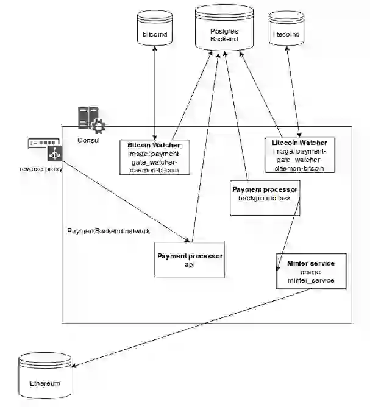

Авторы: Алгыc Иевлев, Алексей Макеев, Вячеслав Мельников, Сергей Прилуцкий, Владимир Храмов.

# Конфигурирование, запуск и взаимодействие с контрактами: конструкторы

Один и тот же смарт-контракт зачастую можно использовать для решения различных бизнес-кейсов. В простом случае от кейса
к кейсу отличаются параметры функции-конструктора смарт-контракта, в более сложном случае - какие-то фрагменты кода
включаются, какие-то исключаются из итогового исходного кода смарт-контракта. Например, в ERC20-токене в простом случае 
объем выпуска (totalSupply) задается как параметр функции-конструктора (здесь и далее под конструктором смарт-контракта 
понимается механизм, предложенный и используемый на платформе Smartz, чтобы не путать его с конструктором в терминах 
объектно-ориентированного программирования, последний будет называться функцией-конструктором). В более сложном случае, например, в токене может быть 
предусмотрено сжигание (burn), реализовать это можно, включив соответствующую функцию в код контракта, либо используя 
наследование: подключив в качестве контракта-родителя контракт токена, имеющего функцию сжигания (см. напр. `BurnableToken`
в [erc20_token_constructor.py](https://github.com/smartzplatform/SDK/blob/ba8230d39e94f70a30e716f4f1e48ddd4e702432/constructor_examples/erc20_token_constructor.py)).
При этом, вероятно, придется внести дополнительную логику, адаптирующую контракт-родитель к контракту-потомку 
(см. напр. `transfer`, `transferFrom`, `burn` в [SmartzToken](https://github.com/smartzplatform/sale/blob/6a00b30ccaa3dabc515ad7dfd29bbd85848c9603/contracts/SmartzToken.sol)).

После того, как смарт-контракт запущен в блокчейн, требуется предоставить пользователям смарт-контракта DApp,
с помощью которого будет удобно взаимодействовать со смарт-контрактом. Здесь также имеют место соображения, изложенные 
параграфом выше: с помощью подготовительных шагов различной сложности можно переиспользовать один и тот же DApp в 
нескольких схожих бизнес-кейсах. Кроме того, простой DApp может быть автоматически сгенерирован на основе 
смарт-контракта.

Мы считаем экономически нецелесообразным для решения каждого нового кейса привлекать разработчика. С другой стороны, 
есть полушуточное выражение "настоящий программист должен быть ленивым", за которым скрывается та мысль, что код 
хорошего программиста структурирован и удобен в переиспользовании, т.о. программисту понадобится меньше времени на 
выполение новой схожей задачи. Исходя из этих предпосылок мы сформулировали такое понятие, как конструктор 
смарт-контрактов. Механизм конструкторов смарт-контрактов на платформе Smartz реализует идеи, изложенные выше.

## Механика работы конструкторов смарт-контрактов

Имеем три ключевые стороны, участвующие в конфигурировании, запуске и взаимодействии со смарт-контрактом: разработчик 
смарт-контракта, пользователь, и платформа Smartz. Разработчик оформляет смарт-контракт в виде конструктора и делает
его переиспользуемым настолько, насколько считает целесообразным. Пользователь запускает смарт-контракт в блокчейн и 
взаимодействует со смарт-контрактом в блокчейне, при этом храня у себя и никому не передавая закрытые ключи своих
блокчейн-аккаунтов. Платформа Smartz выполняет конструктор и все вспомогательные операции, облегчая разработку и 
использование смарт-контрактов.

### Конфигурирование и запуск смарт-контракта

#### Взаимодействие Smartz и конструктора смарт-контрактов

Конструктор смарт-контрактов (далее конструктор) представляет из себя исходный код на том или ином языке 
программирования (Python, javascript, Java, Perl, Ruby, PHP, ...), имеющий определенный программный интерфейс. 
Взаимодействие со Smartz представляет из себя вызов тех или иных методов платформой.

Код конструктора и, как следствие,
код контрактов, им генерируемых, открыт - с тем чтобы имелась возможность производить его аудит. Перед выполнением 
происходит необходимая компиляция и кэширование полученного результата (напр., в случае Java получаем .class-файл, в 
случае Python - .pyc-файл).

Низкоуровневое взаимодействие с конструктором происходит в отдельном сервисе конструкторов. Его логика описана далее.
При необходимости вызвать метод конструктора платформа запускает скомпилированный код
конструктора в изолированном docker-контейнере. В контейнере ограничивается память, число процессов, время работы процессов, 
взаимодействие с дисковой подсистемой и сетью. В контейнер монтируются файл конструктора и библиотека, предоставляющая 
доступ к внутреннему API Smartz. Создание такого контейнера является относительно ресурсоемкой операцией (порядка 1-2
секунды), поэтому контейнеры переиспользуются. Статическая часть сервиса конструкторов, выполняемая в контейнере, 
загружает конкретный конструктор с помощью механики соотв. языка (напр., в случае Java - это ClassLoader, в случае 
Python - importlib) и вызывает нужный метод, передав параметры как аргументы вызова. Результат выполнения возвращается
в сервис конструкторов.

#### Вводные данные для конструктора

Конструктор описывает, какие вводные данные от пользователя он ожидает получить.
Это могут числа, строки, блокчейн-адреса, даты, и много более сложные данные, напр. коллекции и структуры. Кроме того,
на данные полезно наложить ограничения (напр. максимальное число подписей в контракте мультиподписи), так чтобы 
пользователь уже в интерфейсе имел возможность скорректировать данные, а разработчику не пришлось вновь и вновь 
реализовывать логику валидации данных. Это описание мы называем схемой данных.

Для задачи описания схемы данных мы используем готовые решения, близкие к статусу стандарта в той или иной области. Это
имеет следующие премущества:
* Часть разработчиков уже знакома с ними. Те же, кто не знаком, смогут переиспользовать полученные знания при работе над 
другими проектами
* Существуют готовые инструменты и библиотеки, напр. для валидации и генерации интерфейсов.

Smartz планирует поддерживать описание входных данных в форматах [json schema](http://json-schema.org) и 
[OpenAPI Specification](https://swagger.io/specification/) (используется в [swagger](https://swagger.io/)). Кроме того,
Smartz предоставляет готовые описания некоторых типов данных, например Ethereum-адреса или unix timestamp, в терминах
соотв. схем.

Также, схема данных конструктора опционально может быть дополнена схемой отображения (`ui_schema`). Данная схема влияет на отрисовку
интерфейса ввода данных.

Когда пользователь хочет сконфигурировать и запустить некоторый смарт-контракт, он заходит на соотв. страницу на Smartz.
Со страницы отправляется RPC-запрос к платформе, а платформа получает схему данных и схему отображения конкретного конструктора с помощью
вызова `get_params` API конструктора. Схемы передаются через платформу обратно в браузер клиента, где 
обрабатывается клиентским кодом Smartz. На основании схемы данных и отображения автоматически генерируется пользовательский интерфейс
конфигурирования конструктора (задействуя компонент [react jsonschema form](https://github.com/mozilla-services/react-jsonschema-form)).
В интерфейсе отрисовываются наиболее удобные для каждого конкретного типа данных виджеты
(напр. для unix timestamp - календарь с возможностью ввести дату и время, для блокчейн-адресов - адресная книга).
Когда пользователь отправляет форму с параметрами в конструктор, прежде всего происходит их быстрая валидация на соответствие
схеме данных на клиентской стороне, и при необходимости подсвечиваются ошибочно введенные поля. Если все в порядке, 
данные отправляются в Smartz.

#### Генерация и компиляция смарт-контракта

На backend-стороне Smartz получает вводные данные для конструктора и прежде всего валидирует их на соответствие схеме
данных. В случае обнаружения ошибок информация об ошибках отправляется обратно на клиент с детализацией по каждому полю
(используя [python-модуль для работы с json schema](https://github.com/Julian/jsonschema)).
Если ошибок нет, вводные данные передаются в вызов `construct`.

Предполагается, что
конструктор прежде всего выполняет дополнительную, более сложную валидацию. Так, например, в случае multisig-кошелька
существует очевидное условие того, что число владельцев должно быть не меньше, чем кворум подписей. Подобное условие 
не видится целесообразным реализовывать на уровне схем данных. Результатом подобной валидации может явиться либо общая
ошибка, не специфичная для какого-либо конкретного поля (как в ранее приведенном примере), либо ошибка, связанная с 
конкретным полем. И тот и другой случай оформляются в соотв. API-ответ и возвращаются в Smartz, затем они будут переданы
и отрисованы на клиенте.

Затем выполняется генерация кода смарт-контрактов. Организация генерации находится в области ведения разработчика
конструктора, он довольно свободен в своем подходе. Smartz будет предоставлять библиотеку, облегчающую генерацию и делающую
ее более надежной. Так, например, она будет содержать методы безопасной подстановки значений в шаблон смарт-контракта (если 
подстановка не будет осуществлена, это будет автоматически расценено как ошибка - скорее всего, где-то опечатка), а также
проверки того, что все подстановки сделаны. Кроме того, Smartz будет предоставлять набор широко известных шаблонизаторов 
(напр. [Mustache](https://mustache.github.io), [Jinja](http://jinja.pocoo.org), [Thymeleaf](https://www.thymeleaf.org), и т.д.).

В дополнение к генерации, проведенной конструктором, Smartz дополняет исходный код инструкциями по переводу комиссий за
запуск контракта разработчику и платформе.

Результатом генерации является исходный код смарт-контракта на том или ином языке, напр. solidity. Исходный код далее 
передается в инфраструктуру компиляции - это отдельный сервис, использующий набор контейнеров, чтобы компилировать
код смарт-контракта нужной версией нужного языка (напр., в случае Ethereum используем C++ версию компилятора - `solc`).
При прочих равных условиях используется наибольшая допустимая стабильная версия языка.
Одновременно с этим, достигается повышенный уровень изоляции от остальных частей платформы.

В случае ошибок компиляции стандартный поток вывода компилятора возвращается из сервиса компиляции и сохраняется в 
хранилище Smartz. При этом применяем дедупликацию и сжатие записей, отнооящихся к одному и тому же конструктору - 
велика вероятность, что среди них существенен объем дублирования информации. Разработчик будет уведомлен о проблемах 
компиляции через механизм нотификаций, т.к. ошибка компиляции не является штатной ситуацией. Любые ошибки 
пользовательского ввода должны быть проконтролированы и предотвращены на этапе конструктора, далее все данные и код 
должны быть согласованы.

В случае успешной компиляции имеем в качестве результата бинарный код (напр. EVM-байткод, web assembly, и т.д.) и 
интерфейс (напр. ABI). Через Smartz они передаются в браузер пользователю.

Вместе с этим, вызывается метод `post_construct` конструктора, куда передаются вводные данные (те же, что были переданы 
в `construct`) и полученный интерфейс смарт-контракта. На основе этих параметров конструктор имеет возможность обогатить
стандартный DApp, генерируемый платформой, дополнительными данными (см. далее). Уже на этом этапе формируется т.н.
экземпляр (instance) конструктора в рамках платформы, в информацию о нем заносятся исходный код контракта, бинарный код,
интерфейс, дополнительная информация для DApp.

#### Загрузка смарт-контракта в блокчейн

После этапа компиляции в интерфейсе Smartz пользователю предлагается загрузить полученный смарт-контракт в блокчейн. 
Загрузка выполняется полностью на стороне пользователя посредством взаимодействия с блокчейном через браузер. В случае
сети Ethereum для этого подойдет любой браузер, управляющий аккаунтами пользователя и предоставляющий интерфейс 
[web3](https://github.com/ethereum/wiki/wiki/JavaScript-API) (напр. Chrome-подобные браузеры с расширением 
[MetaMask](https://metamask.io) или [Mist](https://github.com/ethereum/mist)). В случае EOS для этого подойдет любой 
браузер, управляющий аккаунтами пользователя и предоставляющий интерфейс [eosjs](https://github.com/EOSIO/eosjs).

Smartz сформирует и попробует отправить в сеть транзакцию загрузки контракта, при этом браузер попросит пользователя
подписать транзакцию, сообщив информацию о комиссиях сети, разработчика и платформы Smartz. Когда транзакция подписана,
она отправляется в сеть и Smartz ожидает ее включения в блокчейн майнерами. Когда транзакция включена в блокчейн,
платформа фиксирует необходимую блокчейн-информацию в экземпляре конструктора, напр. блокчейн-адрес контракта и id сети,
куда контракт был загружен.

После успешной загрузки контракта Smartz планирует автоматически в фоне верифицировать код контракта на профильных block
explorer (напр. [etherscan](https://etherscan.io)), если пользователь не запретил это действие.

Пользователю сообщается блокчейн-адрес контракта и ссылка на DApp, экземпляр добавляется в список экземпляров пользователя.

### Взаимодействие со смарт-контрактами

На странице экземпляра контракта Smartz автоматически строит графический интерфейс DApp исходя из:
* блокчейн-параметров экземпляра контракта
* блокчейн-интерфейса экземпляра контракта
* дополнительной информации, предоставленной в вызове `post_construct`, такой как:
  - дружественные для пользователя названия и описания для функций, их параметров, и возвращаемых значений
  - уточненные типы параметров и возвращаемых значений, напр.:
    - тип даты-времени для unix timestamp, которое по факту хранится в виде обычного числа и представлено как таковое в стандартных DApp-интерфейсах
    - тип хэш файла
    - и т.д.
  - порядок сортировки и группировки элементов управления

Прежде всего интерфейс состоит из общей информации о контракте: наименование экземпляра, адрес, баланс, владельцы (если
применимо в том или ином блокчейне).

#### Функции взаимодействия со смарт-контрактами

Ключевым составным блоком интерфейса являются функции (или методы) контракта. Функции на платформе разделяются на три 
основные группы: функции опроса контракта (read-only) без параметров, функции опроса контракта с параметрами, функции
отсылки транзакций в контракт. Результат работы функций опроса является актуальным лишь для того блока, который являлся
последним блоком основной цепи на момент выполнения функции. Все взаимодействие с контрактом происходит через 
соответствующий интерфейс блокчейна, предоставленный браузером клиента (см. выше).

Функции опроса контракта без параметров задействуются сразу - происходит параллельный вызов каждой из них, получение
и отрисовка результата вызова. Кроме того, часть из них относится разработчиком контракта к панели состояния (dashboard)
экземпляра. Панель состояния экземпляра показывается в первую очередь, в т.ч. на сводных страницах экземпляров 
пользователя.

Функции опроса контракта с параметрами могут быть вызваны через соотв. виджет управления после того, как пользователь
ввел требуемые параметры. Результат получается асинхронно через опрос блокчейна, однако не требуется создавать 
транзакцию и ожидать ее принятия в блокчейн. Как следствие, вызов функций опроса бесплатен для пользователя.

Функции отсылки транзакций в контракт создают транзакцию и в общем случае меняют состояние контракта и состояние 
блокчейна. После того, как пользователь вводит параметры вызова, Smartz формирует транзакцию и предлагает ее на подпись
пользователю. В рамках транзакции возможна отсылка токена (валюты) сети, напр. Ether. Также возможно взымание комиссии
в пользу разработчика контракта, если он подключил такую опцию монетизации. После подписания транзакции пользователем
она отправляется в блокчейн и платформа асинхронно ожидает принятия транзакции в блокчейн. Когда это произойдет, 
пользователь будет проинформирован в интерфейсе экземпляра.

#### Параметры функций, виджеты

Для успешного формирования богатого интерфейса DApp важно уметь описать тот или иной входной или выходной параметр 
функции максимально близко к предметной области, в которой работает данный смарт-контракт. Например, с т.з. блокчейна
параметром двух разных функций контрактов может являться целое число (напр. `uint256` в Ethereum) и т.о., во-первых,
интерфейс DApp этих функций будет одинаков, и, во-вторых, крайне скуден - это будет поле ввода числа. Однако, на самом
деле в одном случае числом может быть сохранено дата и время (unix timestamp), а в другом - количество Ether, указанное в wei.
Обладая этой информацией, Smartz в одном случае вместо поля ввода числа нарисует виджет календаря, а в другом - удобный
виджет ввода количества Ether, без необходимости указывать огромное число wei, и с возможностью ввести количество 
долларов США.

Входные параметры функций могут быть описаны разработчиками конструктора с помощью схемы данных, корневым элементом
которой является либо массив, либо объект (при поддержке именованых параметров в интерфейсе конкретного блокчейна).
Для описания схем используются те же технологии, что и для описания вводных данных пользователя при конструировании
смарт-контракта. При этом платформа определяет готовые типы данных - блокчейн-адреса, дата-время, количество 
криптовалюты, хэш строки, хэш файла и т.д. Для каждой функции на основе схемы ее входных параметров Smartz отрисовывает
виджет управления, взяв за основу [react jsonschema form](https://github.com/mozilla-services/react-jsonschema-form).
Когда параметры введены пользователем происходит их валидация на соответствие схеме, после чего происходит их 
конвертация в формат конкретного блокчейна. Так, например, числа в блокчейне Ethereum при использовании библиотеки 
`web3` следует оформить в виде экземпляров [BigNumber](http://mikemcl.github.io/bignumber.js/). Полученные значения
передаются в код, формирующий транзакцию.

Выходные результаты функций также могут быть снабжены схемой данных. Здесь применяются все те же техники, описанные выше,
но в обратной последовательности. Сначала происходит раскодирование данных из формата блокчейна. Затем, на основе схемы,
предоставленной разработчиком конструктора, происходит наиболее дружественное для пользователя отображение значения.


## SDK

Software development kit (SDK) находится по адресу https://github.com/smartzplatform/SDK. В него входят документация
API, схемы данных, средства запуска и отладки конструкторов, а также законченные примеры кода конструкторов.

В документации API будет приведено полное описание интерфейса платформы, с которым взаимодействует конструктор для всех
поддерживаемых языков разработки конструкторов. Ключевым интерфейсом является интерфейс конструктора, например: 
[для языка Python](https://github.com/smartzplatform/SDK/blob/ba8230d39e94f70a30e716f4f1e48ddd4e702432/api/smartz/api/constructor_engine.py).

В предыдущих разделах упоминалось, что Smartz предоставляет некоторые готовые типы данных для использования в схемах 
данных, напр. блокчейн-адреса и unix timestamp. Все они также содержатся в SDK. Например, для Ethereum имеем следующие 
определения в виде json schema:
```javascript
{
    "$schema": "http://json-schema.org/draft-04/schema#",
    "definitions": {
        "address": {
            "type": "string",
            "pattern": "^(?:0[Xx])?[0-9a-fA-F]{40}$"
        },

        "addressArray": {
            "type": "array",
            "items": { "$ref": "#/definitions/address" }
        },

        "unixTime": {
            "type": "integer",
            "minimum": 1,
            "maximum": 2147483647
        }
        // ...
```

Для разработчика важна скорость разработки и отладки кода. Поэтому Smartz SDK предоставит инструменты быстрого запуска
и отладки конструкторов на локальном компьютере разработчика без необходимости загрузки конструкторов на Smartz.
Так, например, проверить формируемую схему данных можно с помощью консольной команды:
```bash
./SDK/bin/run-constructor.py get_params smartz/backend/constructor_examples/SMRDistributionVault.py
```

А вызвать конструктор и получить код смарт-контракта можно с помощью следующей консольной команды:
```bash
./SDK/bin/run-constructor.py construct --fields-file fields.json smartz/backend/constructor_examples/SMRDistributionVault.py
```

Кроме того, проверить автоматически генерируемый интерфейс DApp можно будет на основе интерфейса смарт-контракта: 
остальные данные будут извлечены из конструктора.

Локальное окружение на компьютере разработчика не может полностью соответствовать окружению Smartz, поэтому следующим,
финальным шагом отладки будет являться загрузка и запуск контракта в тестовом окружении на Smartz, полностью 
соответствующем рабочему, с той лишь разницей, что загруженные конструкторы не будут доступны другим пользователям 
платформы.

Работа со средствами разработки будет интегрирована в качестве плагина в наиболее популярную IDE.

Большая часть конструкторов, разработанных командой Smartz будет представлена как примеры, демонстрирующие использование
платформы и передающие лучшие практики разработки, напр. [см. здесь](https://github.com/smartzplatform/SDK/tree/ba8230d39e94f70a30e716f4f1e48ddd4e702432/constructor_examples).


## API

Клиенты платформы могут работать со Smartz не только из браузеров. Будет предоставляться следующее API.
1. Делаем доступным API вызов `get_params` - получение параметров конструктора.
2. Через API вызов `construct` можно будет вызвать конструктор и получить бинарный код контракта и прочую информацию. 
Затем следует сформировать и подписать транзакцию создания контракта приватным ключом, который все так же хранится на
стороне клиента.
3. Полученную подписанную транзакцию следует отправить в сеть, используя вызов `broadcast_tx`, который выставит 
оптимальные значения комиссии в зависимости от объема транзакции и уровня срочности задачи.

Шаги 2 и 3 будут совмещены в едином сервисе, предоставляемом клиенту либо в виде исходных кодов, собираемых с помощью
[docker](https://www.docker.com), либо в виде docker-образа - на выбор клиента. Таким образом, сервис не вызывает 
необходимости доверять Smartz и является полностью подконтрольным клиенту. Сервису предоставляется доступ к 
приватным ключам, хранимым либо в нодах соотв. блокчейнов, либо в [HashiCorp Vault](https://www.vaultproject.io).
Сервис предоставляет асинхронное API для решения конечной задачи за один шаг: загрузки нужного контракта с заданными 
параметрами в блокчейн. От IT команды клиента не потребуется знания блокчейна и конкретных технологий, поддержания 
инфраструктуры нужных блокчейнов - достаточно будет уметь создать и безопасно хранить приватные ключи, а также работать
с классическим REST API. Использование docker позволит развернуть решение практически на любой инфраструктуре клиента,
в т.ч. в облаке.
Использование сервиса не обязательно и остается сугубо на выбор клиента.

Аналогично, для заданной роли в экземпляре конструктора можно послать транзакцию, также сформировав ее, подписав, и 
отправив через `broadcast_tx`, или проделав все это через сервис.

Также через API будут доступны список экземпляров, запущенных клиентом.


## Интеграция с Github

Типичной частью инфраструктуры разработки смарт-контракта является отдельный репозиторий на [Github](https://github.com),
где содержится исходный код контракта, разбитый на несколько файлов, перечисление зависимостей смарт-контракта, автотесты.
В общем случае конструктор смарт-контракта не может быть автоматически получен из вышеперечисленного, как минимум потому
что в нем содержится много дополнительной информации.

Мы ожидаем, что конструктор смарт-контракта будет располагаться в
подкаталоге `smartz` в репозитории смарт-контракта. Также мы ожидаем найти там публичный Smartz API key разработчика,
human-friendly название и описание конструктора, а также логотип, иллюстрации и прочие сопроводительные материалы.
В этом случае Smartz сможет автоматически загрузить конструктор на платформув качестве пре-релиза, если разработчик укажет URL своего 
репозитория с контрактом.

Также Smartz сможет мониторить новые релизы в репозитории контракта, используя публичное Github API. Для каждого релиза
может быть сформирован пре-релиз на платформе, с включенным в качестве дополнительной информации описанием релиза.

Возможна работа с приватными репозиториями, при предоставлении доступа на их чтение.

Пре-релизы на Smartz становятся открытыми широкой публике через модерацию. Отправка на модерацию может производиться
либо автоматически, либо вручную по запросу разработчика. Всегда выбирать автоматический вариант может быть 
нецелесообразно, т.к. у модерации есть определенные ограничения на частоту запросов, а аудит кода имеет свою цену.


## Интеграция с Travis CI

Также типичной частью инфраструктуры разработки смарт-контракта являются сервисы непрерывной интеграции (Continuous
Integration, CI), такие как [Travis CI](https://travis-ci.org). Типичной является связка Github + Travis CI. Для новых 
правок исходного кода автоматически запускаются автотесты и становится ясным результат автоматического тестирования 
сделанных изменений. В случае подключенного Travis CI и прочих систем непрерывной интеграции, только те правки, которые
успешно прошли автоматическое тестирование, могут быть загружены в качестве пре-релизов на Smartz.

Также будет возможность сконфигурировать загрузку пре-релиза по итогам успешной сборки проекта в системе непрерывной 
интеграции. Процесс похож на описанный в предыдущем разделе: понадобится конструктор, название, описание, и прочие 
материалы, а также закрытый Smartz API key разработчика. Все необходимое будет собрано в один пакет и отправлено в 
Smartz. Smartz предоставит скрипт, позволяющий выполнить указанные действия одной командой, в т.ч. в виде docker-образа.


## Системы контрактов

Подобно тому, как программы, написанные с использованием ООП, состоят из многих взаимодействующих классов, нетривиальные
блокчейн-приложения состоят из нескольких взаимодействующих контрактов. Мы называем это системой контрактов. Типичным 
примером является система контрактов ICO, где есть один или более crowdsale-контракт, в котором заложена логика расчета
цен и т.п., контракт токена, а также контракт-хранилище собранных средств, которое позволит участникам получить средства
обратно, если проект не соберет soft cap.

Если до сих пор мы говорили об исходном коде смарт-контракта как об атомарной, и в то же время самодостаточной единице,
то системы контрактов требуют дополнительных действий со стороны платформы на этапах компиляции и загрузки в блокчейн.

В случае системы контрактов конструктор представляет из себя архив (tag.gz, zip, jar, и т.д.), где содержится все 
необходимое для предоставления платформе исходного кода смарт-контрактов, адаптированных под конкретный запрос 
пользователя. Чаще всего это будут шаблоны исходного кода контрактов плюс логика конструктора в отдельных файлах плюс
файл миграции (см. ниже).

Обработка запроса пользователя внутри платформы происходит следующим образом.
Сервис конструкторов распаковывает архив в изолированном docker-окружении.
В зависимости от используемого языка, на котором написан конструктор, в архиве содержится точка входа, напр. файл 
`constructor.py`, который запускается платформой. На вход он получает пользовательские данные, как и в случае с 
одиночным контрактом. Детали работы сервиса конструкторов рассматривались ранее.

Предполагается, что далее конструктор делает необходимые действия по подготовке кода: подставляет полученные значения
в конфигурационные файлы, запускает шаблонизаторы и т.п. В результате конструктор должен сообщить платформе набор
артефактов исходного кода. Каждый артефакт имеет имя и ссылку на файл внутри каталога, который нужно скомпилировать,
чтобы получить бинарное представление артефакта.

Затем сервис конструкторов передает каталог и информацию об артефактах в сервис компиляции, где для каждого артефакта
получаем его бинарное представление. Детали компиляции рассматривались ранее.

Затем следует передать полученные артефакты в браузер пользователя и выполнить запуск контрактов в блокчейн.

### Загрузка системы смарт-контрактов в блокчейн

Наиболее тонким моментом в задаче поддержки системы контрактов является именно загрузка системы в блокчейн. Это 
обусловлено, во-первых, необходимостью связывания контрактов, и, во-вторых, наличием лимитов, накладываемых блокчейнами
на транзакции, напр. лимит газа в блоке Ethereum. Недостаточно просто последовательно загрузить контракты в блокчейн -
следует их корректно связать. Связывание производится как на этапе загрузки отдельного контракта через аргументы 
функции-конструктора, так и после этого - с помощью отсылки транзакций, напр. вызовов т.н. функций-сеттеров (setters).
Этот процесс обычно описывается т.н. миграциями и для его описания требуется выразительность языка программирования 
общего назначения (напр. в [truffle framework](http://truffleframework.com) миграции пишутся на javascript).

В рамках Smartz миграции будут записываться на специальном декларативном языке, созданном для данной задачи (DSL).
Это будет делаться прежде всего для обеспечения безопасности пользователя и платформы. Несмотря на то, что конструкторы
будут проходить аудит, считаем опасным и преждевременным давать миграциям прямой доступ к API блокчейнов (напр. `web3`)
и блокчейн-аккаунтам пользователя, даже несмотря на то, что все действия потребуют явного подтверждения пользователя.
В будущем, после отдельной проработки, данные ограничения, возможно, будут сняты или ослаблены. Для отдельных контрактов
в случае необходимости и только после тщательного аудита могут быть допущены миграции, написанные на javascript.

Язык миграций будет иметь следующие примитивы:

* Загрузка в блокчейн одного из артефактов, полученных ранее. 
* Вызов заданной функции одного из загруженных артефактов.
* Аргументами вызовов (в т.ч. функций-конструкторов контрактов) могут стать константы, данные, полученные от 
пользователя, а также адреса уже загруженных артефактов.
* Возможность указать дружественное пользователю описание текущего шага.

В браузер клиента будут загружены артефакты, вводные данные пользователя и обработчик миграций.
Язык миграций будет интерпретироваться кодом платформы и производить необходимые действия, пользуясь API блокчейнов и 
данными, перечисленными ранее.

Напр., для описанной выше системы контрактов ICO получим следующую миграцию:

```c++
token = deploy('Token', fields.owners);
funds = deploy('FundsRegistry', fields.owners);

sale = deploy('Crowdsale', fields.owners, token.address, funds.address);

token.transact('setController', sale.address);
funds.transact('setController', sale.address);
```

### Кросс-чейн системы контрактов

Кросс-чейн системы контрактов представляют из себя набор контрактов, находящихся в разных блокчейнах, но 
взаимодействующих между собой. Взаимодействие может быть как непосредственное - напр., с помощью block relay или
para-chains (напр. см. [Polkadot](https://medium.com/polkadot-network/polkadot-the-parachain-3808040a769a)),
так и оркестрируемое с помощью DApp (напр. см. [POA Bridge UI](https://bridge.poa.net)). Классическим
примером кросс-чейн системы контрактов является atomic swap, состоящий из двух контрактов - по одному в каждом 
блокчейне.

Чтобы поддержать кросс-чейн системы контрактов Smartz добавляет следующие изменения в подход, описанный выше. Во-первых,
конструктор для каждого артефакта сообщает к какому блокчейну он относится. Сервис компиляции учитывает это знание и
вызывает соотв. инфраструктуру компиляции. Пример такого результата работы конструктора в случае atomic swap приведен 
ниже:

```json
{
    "EthereumSide": {
        "file": "ethereum/contracts/AtomicSwap.sol",
        "blockchain": "ethereum"
    },
    
    "EOSSide": {
        "file": "EOS/src/AtomicSwap.cpp",
        "blockchain": "EOS"
    }
}
```

Во-вторых, на этапе загрузки системы смарт-контрактов в блокчейны директива загрузки контракта языка миграций 
автоматически узнает из описания артефактов, в какой блокчейн следует загружать контракт. При этом, такие параметры
вызова функций, как адреса контрактов, все также доступны для любого блокчейна - для выполнения связи контрактов
(если требуется установить непосредственную связь контрактов, см. выше). Т.о., скрипт миграции в данном случае 
оказывается предельно простым:

```c++
deploy('EthereumSide');
deploy('EOSSide');
```

Также, будет возможность параметризовать блокчейн, в который загружается контракт, создав спецификацию блокчейна. Напр.,
кодовая база Ethereum поддерживает блокчейны с разным параметром `network_id` (`network_id = 1` - основная сеть, `network_id = 4` - 
тестовая сеть rinkeby), а также существуют форки Ethereum, использующие данный механизм, напр. `network_id = 99` - Core,
публичный основной блокчейн [POA Network](https://poa.network). В случае загрузки моста между двумя Ethereum-подобными
блокчейнами получим следующую миграцию:

```c++
EthereumMainnet = define_network('Ethereum', network_id=1);
POACore = define_network('Ethereum', network_id=99);

deploy('ForeignBridge', network=EthereumMainnet);
deploy('HomeBridge', network=POACore);
```


# Управление контрактами

Базовая механика управления контрактами описана в разделе "Взаимодействие со смарт-контрактами". Здесь мы остановимся
на дополнительных возможностях, предоставляемых Smartz.

## Custom DApps

В простом варианте пользовательский интерфейс экземпляра конструктора генерируется автоматически на основе программного
интерфейса и дополнительных подсказок разработчика, этот процесс был описан выше. Для того, чтобы предоставить богатый
возможностями и удобный DApp этого не всегда будет достаточно. Smartz предоставит разработчикам возможность загрузить и предоставить
пользователям полноценный пользовательский интерфейс DApp, реализованный на javascript или TypeScript. Этот подход предоставляет максимально широкую
свободу и возможности разработчику, но и требует особого внимания на этапе аудита. Мы не видим целесообразным 
останавливаться на полумерах, напр. конструировании некой промежуточной абстракции, предоставляющей ограниченный набор 
предопределенных графических примитивов и операций, т.к. это потребует больших усилий и, скорее всего, не решит исходную
задачу.

Будут поддержаны пользовательские интерфейсы DApp, реализованные в виде SPA (Single Page Application), в т.ч. с 
использованием фреймворков React, Angular, Vue.js.

Для каждого конструктора будет предусмотрена возможность иметь только один custom DApp, т.к. нет необходимости 
задействовать механизмы генерации кода на данном этапе. Вместо этого, при запуске custom DApp платформа сообщит ему 
следующие параметры:

* пользовательские вводные данные для конструктора (если применимо, см. ниже "Custom DApp marketplace")
* "координаты" контрактов: спецификация блокчейна (см. "Кросс-чейн системы контрактов"), адрес контракта
* интерфейс(ы) контрактов

Исходя из этих данных custom DApp сможет нужным образом адаптировать пользовательский интерфейс.

Custom DApp должен быть представлен в виде исходных кодов проекта и необходимых ресурсов. Перед публикацией он пройдет
аудит. Для обеспечения безопасности будет введен белый список зависимостей, которые можно использовать в проекте.
Для обеспечения надежности будет производится кэширование требуемых версий зависимостей на серверах Smartz и их 
использование в случае недоступности или компрометации основного источника кода, напр. npm-репозитория или отдельных 
пакетов.

Ранее уже были случаи подмены пакетов в npm-репозитории, а также случаи внедрения 
[вредоносных пакетов](https://www.twilio.com/blog/2017/08/find-projects-infected-by-malicious-npm-packages.html). 
Многие аккаунты, загружающие npm-пакеты [плохо защищены](https://www.bleepingcomputer.com/news/security/52-percent-of-all-javascript-npm-packages-could-have-been-hacked-via-weak-credentials/).
Помимо упомянутых белых списков, для защиты целостности DApp, а также для снятия необходимости доверия платформе Smartz,
будет использоваться механизм контроля целостности. 

1. От разработчика обязательно требуется использовать `package-lock.json` (помимо контроля целостности это также даст стабильное, воспроизводимо работающее приложение).
2. На этапе сборки интерфейса DApp контролируется целостность всех зависимостей с помощью npm-механизма 
`Standard Subresource Integrity`. Затем, вычисляется хэш собранного приложения.
3. На этапе запуска у пользователя выполняется код контроля целостности. Он представляет из себя открытый, не минифицированный, компактный 
код, его собственная целостность может быть проверена его хэшированием. Код контроля целостности сверяет хэш приложения,
а также публикует его, вместе с его [identicon](https://en.wikipedia.org/wiki/Identicon).

Для исключения влияния друг на друга и на платформу, custom DApp будут размещаться на различных поддоменах Smartz, 
уникальных для каждого экземпляра конструктора.

Статические ресурсы, такие как изображения и CSS, должны быть помещены в подкаталог `static` - они будут автоматически 
размещены на серверах Smartz и доступны в интерфейсе DApp по соотв. пути, начинающемуся со `/static/`.


## Local DApps

Для полного снятия зависимости пользователя от платформы Smartz, интерфейс любого из запущенных им DApp, а также любого из DApp, к
которым пользователь имеет доступ, в будущем может быть скачан пользователем с платформы и сохранен локально в 
полностью рабочем состоянии (сохранять другую составляющую DApp - контракты - нет смысла, т.к. они выполняются в соотв. 
блокчейнах).

Локальная копия представляет из себя архив, содержащий javascript или TypeScript логику и ресурсы. Он может быть запущен
в любом браузере или приложении, предоставляющем интерфейсы к соотв. блокчейнам (web3.js, eosjs, и т.д.).

Платформа будет также иметь возможность выдать пользователю т.н. `package-lock` интерфейса DApp и его исходные коды,
с тем чтобы интерфейс мог быть собран пользователем самостоятельно - что снимает необходимость доверия к Smartz и
позволяет полностью проинспектировать DApp на наличие закладок и нежелательной логики перед запуском.

Local DApps будут доступны как для автоматически генерируемых платформой интерфейсов, так и для custom DApps.

Реализация Local DApps на стороне платформы предельно близка к DApps, работающих в web-режиме. В обоих режимах DApp
состоит из ресурсов и статической части (которая не меняется от экземпляра к экземпляру: для автоматически генерируемых 
интерфейсов - это часть кода платформы, для custom DApps - это код разработчика DApp), а также динамической части (она 
состоит из пользовательских вводных данных, "координат" контрактов, интерфейсов контрактов).

Статическая часть в одном случае публикуется в web, в другом - сохраняется в архив. Динамическая часть в случае web DApp
включается в web-страницу экземпляра конструктора, в случае local DApp - будет сохранена в виде json в javascript-файл и
подключена к DApp.

Local DApps также снабжаются механизмом контроля целостности, описанным в предыдущем разделе.


## Control panels

Поскольку custom DApp не являются тесно связанными с конкретным экземпляром конструктора, а адаптируются динамически
на основе сведений о экземпляре (см. "Custom DApps"), а также поскольку интерфейсы и код смарт-контрактов могут быть 
открытыми, у разработчика появляется возможность писать интерфейсы DApp для контрактов, созданных другими разработчиками.

Этот отдельный вид конструкторов на платформе называется контрольной панелью. Механика работы следующая.

Платформа вызывает `get_params`, и рисует интерфейс для вводных данных пользователя. Ввод пользователя валидируется.

Не происходит компиляции никаких смарт-контрактов - вместо этого вызывается метод `post_construct`. Он должен сообщить
координаты контрактов, которым будет управлять данный экземпляр контрольной панели.

Дальнейшая механика схожа с ранее описанной. Платформа собирает интерфейс DApp, и в случае работы в web-варианте 
инициализирует его нужными данными, хранящимися в Smartz (координаты контрактов и т.д.). В случае local DApp собранное 
приложение и пользовательские вводные данные будут выданы в виде архива.


## Custom DApp marketplace

Контрольные панели также получат свой маркетплейс, схожий с маркетплейсом конструкторов. Разработчики смогут написать 
интерфейсы DApp для контрактов, созданных другими разработчиками.

Можно привести несколько примеров таких контрольных панелей:

* Контрольная панель для управления конкретными популярными токенами. По сути это возможность создать "лучший" кошелек,
специфичный для того или иного токена и учитывающий его механику, иначе неизвестную через ERC20-интерфейс. Такая 
контрольная панель, конечно, будет содержать в себе информацию о координатах контракта токена.
* Контрольная панель для ERC20 токенов. Более удобная и информативная, нежели стандартный Mist-интерфейс.


## Управление системой контрактов

Управление системой контрактов концептуально не сильно отличается от управления отдельным контрактом, описанного выше.
В случае автоматически генерируемых интерфейсов эта генерация производится для каждого из контрактов системы, плюс 
платформа дает возможность указать очередность следования интерфейсов составляющих системы и состав общего дашборда 
системы. В случае custom DApp у приложения есть доступ ко всем необходимым данным - пользовательские вводные, координаты
контрактов и т.д., и автор DApp имеет полную свободу организации интерфейса к системе.

Транзакции могут быть посланы в нужный контракт в нужном блокчейне, используя соотв. клиентскую библиотеку, на основе
параметров блокчейна, адреса и интерфейса контракта.


# Платформа

Помимо описанных ранее функций конструирования и управления DApp, платформа представляет из себя богатый web-портал.

Бэкенд платформы разрабатывается с использованием фреймворка [Django](https://www.djangoproject.com) на третьей
версии языка [Python](https://www.python.org). Django предоставляет много готовых решений - управление пользователями и
группами, интерфейс админинстрирования, подсистемы управления и тестирования. Также существует много готовых интеграций,
напр. Django-приложение для [Python Social Auth](https://github.com/python-social-auth/social-app-django).

В качестве базы данных используем [PostgreSQL](https://www.postgresql.org/). Это позволит разработчикам платформы 
иметь богатый инструментарий, такой как триггеры, rule system, операторы, индексы с условием, оконные функции и т.д.

Микросервисы в рамках платформы организуются с помощью [Flask](http://flask.pocoo.org).

Пользовательский интерфейс разрабатывается в виде Single Page Application, что позволяет добиться лучшего user 
experience. Основная используемая технология - [React](https://reactjs.org).

В качестве обратного прокси используем [Nginx](https://www.nginx.com).

Для создания воспроизводимого окружения и минимизации затрат разработчиков и системных админинстраторов на однотипные
задачи развертывания программного обеспечения активно используем Docker и [Ansible](https://www.ansible.com).

Для сбора метрик, мониторинга систем и внутренних оповещений используем [Telegraf](https://github.com/influxdata/telegraf),
[InfluxDB](https://www.influxdata.com), [Grafana](https://grafana.com).


## Аутентификация

Для аутентификации пользователей будут поддерживаться несколько методов.

**Аутентификация с помощью подписи закрытым ключом**. Это вариант challenge-response протокола. Платформа генерирует 
уникальное сообщение, содержащее информацию о том, что сообщение сформировано в интересах аутентификации на Smartz,
адреса пользователя и текущего времени. Интерфейс платформы предложит в течение определенного времени подписать 
сообщение закрытым ключом и отправит на проверку в Smartz. Подпись будет проверена используя открытый ключ пользователя.
Для подписи, напр., могут быть использованы возможности 
[подписи сообщений в MetaMask](https://medium.com/metamask/the-new-secure-way-to-sign-data-in-your-browser-6af9dd2a1527).

**Аутентификация с помощью OAuth2**. Будут использованы социальные провайдеры аутентификации, такие как Facebook,
Github, Google+.

**Классическая аутентификация по паролю**. Пароли будут храниться в базе в хэшированном виде, используя дополнительный 
случайный параметр (т.н. salt) для исключения атак перебором.

При этом аутентификация, проведенная одним пользователем используя различные методы, не будет порождать несколько 
аккаунтов на платформе - будет дана возможность связывать новые методы аутентификации с аккаунтом в личном кабинете.

Администраторам будет доступна функция login as - позволяющая получить доступ на чтение от лица какого-либо аккаунта
в целях диагностики проблем пользователя.

Также, опционально поддержим двухфакторную аутентификацию, используя Google Authenticator.


## Механизм уведомлений

Внутренне будет реализован механизм `notify(user, subject, message)`.

Пользователь сможет настроить в профиле уведомления в интерфейсе платформы, на почту, в телеграм. Данный механизм будет
использоваться различными подсистемами Smartz.


## Ключевые сущности

### Группы

Управление правами внутри платформы осуществяется через следующие группы:

* админинстраторы
* разработчики
* партнеры (интеграторы)
* модераторы разработчиков
* модераторы контрактов
* модераторы партнеров

### Конструктор

Конструкторы создают разработчики. Ключевые функции - создание, изменение состояния, просмотр.

Состояния конструктора:
* черновик
* на модерации
* опубликован
* в архиве
* заблокирован

Пользователи видят конструктор только в статусе опубликован. Автор - видит во всех состояниях.

Автор может делать следующие переходы состояний:

* черновик -> на модерации, архив
* опубликован -> архив

Среди полей конструктора присутствуют т.н. тэги - однословные, реже в виде словосочетаний, характеристики конструктора,
задаваемые автором, по которым пользователи смогут осуществлять высокорелевантный поиск конструкторов, напр.: multisig,
token. Интерфейс ввода тэгов представляет из себя типичную строка ввода тэгов, с подсказками. Подсказки будут 
реализованы с помощью 
[AnalyzingInfixSuggester](https://lucene.apache.org/core/7_2_1/suggest/org/apache/lucene/search/suggest/analyzing/AnalyzingInfixSuggester.html).
Сортировка - по частоте использования (указания в конструкторах).

### Экземпляр конструктора

Хранит в себе информацию о том, какой конструктор был запущен, каким пользователем, каковы его детали (параметры, 
полученные интерфейсы и т.д.), каковы координаты контрактов.

### Статистика запусков конструкторов

Фиксирует факты запусков конструкторов в блокчейн. Состоит из экземпляров конструкторов и информации о уплаченных
вознаграждениях - платформе и разработчику.


## Модерация

Модерируемых сущностей три: разработчики, конструкторы, партнеры. Для всех из них есть общая логика работы.

* Есть заявки на модерацию (напр. знание о том, что пользователь хочет стать разработчиком, или знание о том, что 
отправлен на публикацию новый конструктор).

* Есть интерфейс со списком заявок, где для каждой заявки:
    * Отображается общая информация. Если информации много - ссылка на детализацию, которая подгружает 
    дополнительную информацию сразу в страницу
    * Возможность кнопками взять заявку в работу или отменить взятие в работу - для синхронизации между модераторами.
    При этом, в списке показываем только не взятое в работу. Администраторам даем возможность отмены взятия в работу для
    заявок указанного модератора.

* Список заявок отсортирован по критерию, частному для каждой сущности.

* Для заявки даем модератору возможность одобрить и отклонить (с указанием причины). В случае отклонения заявки - шлем 
нотификацию соотв. пользователю.

Также есть частная логика работы:

* Создание заявки

    * На модерацию разработчика - когда пользователь сказал в профиле, что хочет быть разработчиком
    * На модерацию партнера - когда пользователь сказал в профиле, что хочет быть партнером
    * На создание конструктора - когда автор нажал публиковать конструктор

* Сортировка заявок в списке

    * На модерацию разработчика - более старые сверху
    * На модерацию партнера - более старые сверху
    * На создание конструктора - в порядке бизнес-функции ранжирования

* Одобрение заявки

    * На модерацию разработчика - ставим флаг, шлем нотификацию
    * На модерацию партнера - ставим флаг, шлем нотификацию
    * На создание конструктора - меняем состояние, шлем нотификацию


## Маркетплейс

### Список конструкторов

Внутри платформы существует единая логика, обрабатывающая запрос списка конструкторов. Среди ее возможностей:
* фильтр по разработчику
* фильтр по тэгам
* фильтр по статусу и признаку аудита
* постраничная итерация

**Общий список конструкторов**. Предназначается для пользователей. Отображает конструкторы только в статусе 
опубликовано, только от не-заблокированных разработчиков. Среди фильтров: тэги, вхождение слов (полнотекстовый поиск по 
названию и описанию). Постраничная итерация.

**Пользователь: страница информации о разработчике**. Страница разработчика, какой видит ее пользователь. Список 
конструкторов, отфильтрованный по данному разработчику, фильтр по тэгам, постраничная итерация. Фильтр показывает только
конструкторы, прошедшие модерацию.

**Разработчик: страница информации о разработчике**. Страница разработчика, какой видит ее разработчик. Список 
конструкторов, отфильтрованный по данному разработчику, фильтр по тэгам, постраничная итерация, управляющие элементы 
для конструкторов.

**Пользователь: список запущенных им конструкторов**. Список запущенных конструкторов, сортированный по дате с 
постраничной итерацией и ссылками.

### Статистика

**Статистика пользователя**. Статистика по запускам, выполненным конкретным пользователем.
Суммарная по конструкторам (конструктор => (запуски, деньги)).
Суммарная по месяцам (месяц => (конструктор => (запуски, деньги))).
Каждое число запусков разворачиваемо в список запусков.

**Статистика разработчика**. Статистика по запускам конструкторов конкретного разработчика.
Суммарная по конструкторам (конструктор => (запуски, деньги)).
Суммарная по месяцам (месяц => (конструктор => (запуски, деньги))).

### Топы

Будут реализованы автоматические рейтинги конструкторов.

1. топ платных (сортировка по деньгам)

2. топ бесплатных (сортировка по числу запусков)

3. топ новых за месяц (5 платных, 5 бесплатных, их сортировки - см. выше)

4. по каждому из 8 популярных тэгов: свой топ (5 платных, 5 бесплатных, их сортировки - см. выше)

А также подборка редакции, составляемая вручную. Все топы - максимум по 10 контрактов.

### Рейтинговая система

Для конструкторов и для разработчиков автоматически ведутся рейтинги, на основе пользовательских оценок.
Рейтинговая система - десятибальная. Отображение рейтингов - в виде 5 звезд, часть из которых может быть неактивна.
Также неактивной может быть половина звезды в случае нечетного рейтинга. Допускается оценка только пользователями,
запустившими данный конструктор, либо конструктор данного разработчика.

При вычислении рейтинга учитывается не только средняя оценка, но также частота и актуальность оценок. Рейтинг не 
вычисляется при отсутствии актуальных оценок.
Рейтинг вычисляется по формуле:

```
rating = weighted_avg_rating / 2 + 5 * (1 − exp(−quantity / quantity_baseline))
```

где `quantity` - число оценок,

`quantity_baseline` - базовый показатель числа оценок, вычисляемый как среднее число оценок для сущности,

`weighted_avg_rating` - взвешенная актуальностью средняя оценка, вычисляемая как:

```
weighted_avg_rating = sum(mark_i * (max(actuality_baseline - age_i, 0))) / sum(max(actuality_baseline - age_i, 0))
```

где `sum` производит суммирование по всем оценкам,

`mark_i` - i-я оценка от 0 до 10,

`age_i` - возраст i-й оценки в днях,

`actuality_baseline` - окно актуальности, равное двум годам в днях.


## Поиск

За основу поисковой технологии берем [Elasticsearch](https://www.elastic.co). Так же как и 
[Apache Solr](http://lucene.apache.org/solr/) это решение базируется на библиотеке [Lucene](http://lucene.apache.org).
Lucene имеет наилучшее соотношение функций, расширяемости, надежности и производительности среди поисковых движков с открытым исходным
кодом. Elasticsearch добавляет к Lucene горизонтальное масштабирование и обеспечивает надежность и высокую доступность
поискового кластера.

### Индексирование

Будут введены три поисковых индекса - по конструкторам, по custom DApp, и по публичным страницам разработчиков. 
Поисковый индекс состоит из документов. Документ, в свою очередь, состоит из полей (также называемых свойствами).

Отправка документов либо их изменений на индексирование осуществляется через очередь 
[Apache Kafka](https://kafka.apache.org).

### Анализ документов

Анализом документов называют процесс преобразования документа к набору термов, каждый из которых представляет из себя
некоторую общую форму слова (напр., в простейшем случае - слово без окончания, в нижнем регистре). Для различных полей
документа применяем разные подходы анализа. Часть полей будут являться искуственными.

Для каждого из документов создается общее поле поиска, представляющее из себя объединение текстовых полей, в которых 
будет осуществляться поиск, если пользователь не указал в каком конкретно поле искать. В общее поле целиком 
индексируется описание соотв. сущности, название, тэги, прочая информация. Слияние нескольких полей в общее производим
перечислением их в виде массива (Elasticsearch при этом задействует механизм `position_increment_gap` Lucene, не оказав
негативного влияния на размер индекса) - т.о. по поисковому запросу в т.ч. будут находиться документы, для которых 
часть слов запроса находится в названии, а часть в описании. Прочие поля дополнительно анализируются и индексируются 
отдельно. Поле название анализируется стандартным анализатором. Поле тэгов анализируется с помощью 
`keyword`-анализатора, т.к. для них нежелательно применение морфологии или каких-либо других приведений к общим формам.

Поиск будет поддерживать морфологию многих естественных языков, это будет достигнуто встроенными в Lucene 
[анализаторами](https://github.com/apache/lucene-solr/tree/master/lucene/analysis/common/src/java/org/apache/lucene/analysis).

### Ранжирование

В основе ранжирования лежит т.н. текстовое ранжирование на основе вхождений слов (т.н. термов) поискового запроса в 
документы, а также степени близости слов фразы и т.д. Для текстового ранжирования будет использована функция 
[Okapi BM25](https://en.wikipedia.org/wiki/Okapi_BM25).

Кроме того, усиливаем важность вхождений слов запроса в название и тэги, используя `boosting query`.

Числовой рейтинг конструкторов, custom DApps, разработчиков также будет входить в поисковый индекс в виде т.н. 
`numeric doc values`. Их значение будет влиять на ранжирование. `Numeric doc values` полезны тем, что есть возможность
их обновлять не переиндексируя документы полностью.

### Поисковые подсказки (suggests)

Поисковые подсказки будут появляться при вводе какой-либо информации в текстовые поля, напр. вводе поискового запроса в 
строку поиска или при вводе тэгов. Индексы подсказок являются отдельными от остальных поисковых индексов и строятся на
основе [finite-state transducer](https://en.wikipedia.org/wiki/Finite-state_transducer).

Как уже упоминалось ранее, в `Lucene` планируется использовать `AnalyzingInfixSuggester`, сочетающий возможности анализа
и поиска слов в любой части фразы.


## Рекомендательная система

Рекомендательная система призвана максимизировать степень удовлетворенности пользователей и доход разработчиков и 
платформы, предлагая варианты конструкторов и DApps, которые могут заинтересовать пользователя, на основе машинного
обучения.

Технически в основе рекомендательной системы Smartz будут лежать решения с открытым исходным кодом
[Seldon Core](https://www.seldon.io) и [Apache Spark](https://spark.apache.org/).

Основной вид рекомендаций - рекомендации, связанные с покупками, аналог "people who bought this also bought..." от 
Amazon. Основывается на данных о запусках пользователем конструкторов и DApps. Рекомендательная модель переобучается 
полностью, offline. Будет использован алгоритм `Item Activity Correlation`. Для каждой из покупок будет сформирован
набор из нескольких рекомендаций, которые, вероятно, будут также куплены пользователем.

Дополнительно в ходе просмотров пользователем страниц на платформе в режиме online формируем рекомендации на основе 
текста и тэгов просмотренных пользователем конструкторов и DApps, используя алгоритм `Content Similarity`. Будет 
использована техника семантических векторов, загружаемых в оперативную память серверов.


## Высокая доступность и отказоустойчивость

### Определения и требования

Инфраструктура Smartz, выполняющая вычисления и хранящая данные разделяется на две категории: т.н. online и offline.

* Online-инфраструктура отвечает на запросы пользователя, на запросы к API и прочие запросы от внешних интеграций. Ее 
восстановление в случае сбоев не должно превышать 5-20 секунд.
* Offline-инфраструктура выполняет фоновые задачи, такие как построение и обновление моделей машинного обучения, 
оптимизация поисковых индексов, расчет т.н. "медленных" статистик. Ее восстановление в случае сбоев может занять до
нескольких часов. Это не означает, что какие-то части платформы перестанут работать на это время - это лишь значит,
напр., что алгоритм машинного обучения будет работать с моделью, полученной сутки назад и дающей чуть менее
оптимальные предсказания.

Существует требование надежного хранения данных - никакая информация, сохраненная в рамках платформы Smartz не может 
быть потеряна. Кроме того, существует требование географической доступности - сбои инфраструктуры на уровне датацентров,
а также на уровне географических регионов (напр. в случае сетевых проблем) не должны повлиять на доступность платформы
вцелом.

Различают сервисы с состоянием (stateful) и без состояния (stateless). Если сервис не имеет состояния, он состоит 
исключительно из своего кода или исполняемых файлов, которые получаются в результате сборки из репозитория исходного
кода. Такие сервисы могут быть легко перенесены с сервера на сервер, могут быть легко размножены и горизонтально 
масштабированы. С другой стороны, ярким примером сервиса с состоянием является база данных. Сервис с состоянием требует дополнительных
усилий и более сложных подходов для обеспечения его доступности и надежности.

### Географическая доступность

Каждый раз, когда далее мы будем говорить о репликации того или иного сервиса, нужно иметь ввиду, что репликация 
производится во-первых, внутри датацентра для обеспечения оперативной доступности в случае выхода из строя оборудования
внутри датацентра, и, во-вторых, в один и более дополнительный регион для обеспечения защиты от сетевых проблем на 
уровне региона.

Если в конкретном случае не оговорено иное, не производится разбиение какого-либо кластера (шардинг) между регионами - задержка 
сетевого взаимодействия серьезно ухудшит работу кластера. Вместо этого, создаются независимые кластеры в двух и более регионах,
один из которых выполняет роль мастера, остальные - реплик.

### Online-инфраструктура

На платформе как едином целом для задач Service Discovery, координации и конфигурирования используется 
[Consul](https://www.consul.io).

PostgreSQL - сервис с состоянием, реплицируется на две и более реплики в каждом регионе. Репликация выполняется с 
помощью [stolon](https://github.com/sorintlab/stolon), ориентированного на обеспечение репликации и высокой доступности
PostgreSQL в облаке. Реплики обслуживают запросы, требующие исключительно доступа на чтение базы данных.
Также, одна из реплик является standby-мастером. С одной из реплик производится регулярное резервное копирование БД в 
долговременное хранилище (см. ниже).

Веб-сервера, на которых работает Django, а также обратные прокси являются сервисами без состояния и всегда развернуты
в нескольких экземплярах, готовые обрабатывать запросы. Обновление программного обеспечения платформы выкатывается на 
все экземпляры веб-серверов следующим образом: создаются новые виртуальные машины и добавляются в балансировщик нагрузки,
старые виртуальные машины по мере завершения обработки пользовательских запросов выводятся из балансировщика нагрузки. 
Нагрузка балансируется на все экземпляры. 

В случае отказа мастера PostgreSQL будет произведено автоматическое переключение на одну из реплик и уведомление системных 
админинстраторов.

Сервисы выполнения конструкторов и компиляции не имеют состояния, они резервируются и масштабируются аналогично 
веб-серверам. Взаимодействие платформы с ними происходит через очередь сообщений с использованием Apache Kafka. Она, в
свою очередь, имеет встроенный механизм масштабирования и обеспечения отказоустойчивости.

Кластер полнотекстового поиска на основе Elasticsearch также имеет встроенный механизм масштабирования и обеспечения 
отказоустойчивости.

### Offline-инфраструктура

Offline-вычисления базируются на Apache Spark. Кластер Apache Spark сам по себе является масштабируемым и 
отказоустойчивым решением, защищающим от проблем внутри датацентра, таких как выходы из строя отдельных машин кластера.
В то же время, данный сервис не имеет состояния: долговременное хранение больших данных осуществляется с помощью сервисов
[Amazon S3](https://aws.amazon.com/s3/) и [Amazon Glacier](https://aws.amazon.com/glacier/) в нескольких географических
регионах. В случае отказа на уровне датацентра или региона, где был развернут кластер Apache Spark, новый кластер Apache
Spark может быть развернут и наполнен нужными данными в течение нескольких часов.


# Поддержка блокчейнов

## Ethereum

Для компиляции смарт-контрактов используем несколько версий C++ реализации компилятора Solidity: 
[solc](https://github.com/ethereum/solidity). Анализируем `pragma solidity` и выбираем наиболее свежую версию, 
удовлетворяющую требованию разработчика.

Для поддержки работы клиентского кода используем [MetaMask](https://metamask.io) либо [Mist](https://github.com/ethereum/mist)
либо [Trust Wallet](https://trustwalletapp.com).

Для поддержки работы API поднимаем [собственный кластер Ethereum узлов](https://github.com/smartzplatform/geth) в каждом
географическом регионе.


## EOS

Мы активно внедряем EOS на платформу и готовим под нее контракты, которые пока разрабатываем на C++. Smartz шаблонизирует 
и компилирует код контракта (используем eoscpp из официального репозитария [eos](https://github.com/EOSIO/eos), 
получает в качестве результата wasm код и его abi, и отдает код контракта клиенту на подпись и отправку в сеть EOS.

В качестве клиента сейчас мы используем браузерное расширение [Scatter](https://github.com/EOSEssentials/Scatter), 
но, как и в случае с Metamask, годится любой клиентский код, способный формировать и подписывать транзакции по созданию контракта в EOS.

Для обеспечения отправки контрактов в сеть EOS и надежного получения событий от блокчейна EOS мы запускаем собственные 
ноды блокчейна EOS, и готовим для работы в mainnet отказоустойчивую систему из нескольких серверов, 
с резервированием и отлаженной процедурой апгрейда ноды на новую версию софта. На данный момент мы используем 
версию [dawn-4.1.0](https://github.com/EOSIO/eos/tree/dawn-v4.1.0) и обновляем ноду при выходе новых версий.

Мы зарегистрированы как кандидаты в block-producer-ы mainnet-а EOS, активно участвуем в запуске Jungle3 EOS Testnet, 
планируем предоставлять пользователям надежный сервис для доступа к блокчейну EOS.


# Интеграции смарт-контрактов


## Платежи

Крайне удобно иметь возможность отправлять в Ethereum или EOS смарт-контракт платежи в биткоине или других криптовалютах.
Существует несколько вариантов реализации подобных платежей: обобщенный atomic swap, передача блоков, доверенный 
платежный шлюз.

### Обобщенный atomic swap

Это развитие протокола atomic swap, упоминавшегося ранее. Предположим, Алиса хочет передать Бобу 2 BTC в обмен на 
какое-либо действие в сети Ethereum (напр., добавление ее во владельцы какого-либо контракта). Их последовательность 
действий следующая:

1. Алиса говорит Бобу свой Ethereum-адрес.
2. Боб выбирает случайный прообраз хэша S, создает контракт-действие в блокчейне Ethereum (см. ниже) и скрипт для платежа
в блокчейне Bitcoin, блокирующий биткоины так, что Алиса сможет забрать их не ранее, чем через сутки.
3. Алиса проверяет код контрактов и переводит 2 BTC на скрипт платежа в блокчейне Bitcoin.
4. Боб публикует S и забирает 2 BTC в течение суток.
5. Алиса, зная S, выполняет действие в блокчейне Ethereum в течение 2 суток.

Контракт-действие в блокчейне Ethereum может выглядеть так:

```solidity
interface IExternalPayment {
    function paymentReceived(address from, string coinType, uint amount) external;
}

contract Action {
    function process(bytes S) external {
        require(sha256(S) == hash);
        target.paymentReceived(AliceAddress, coinType, paymentAmount);
    }
    
    bytes32 public constant hash = hex'b5bb9d8014a0f9b1d61e21e796d78dccdf1352f23cd32812f4850b878ae4944c';
    
    IExternalPayment public constant target = IExternalPayment(address(0x200470e91be919355f3007490fce95635261d798));
    address public constant AliceAddress = address(0x200470e91be919355f3007490fce95635261d799);
    string public constant coinType = "BTC";
    uint public constant paymentAmount = 2;
}
```

Алиса на шаге 3 должна проверить constant-параметры, а также то, что данный контракт имеет полномочия на выполнение действия над
контрактом `target` и не утеряет их в ближайшие двое суток.

Контракт `target` должен позаботиться о том, чтобы одно и то же действие не было выполнено дважды.

Скрипт для платежа в блокчейне Bitcoin должен представлять из себя Hashed TimeLock Contract, где также заложен хэш
`b5bb9d8014a0f9b1d61e21e796d78dccdf1352f23cd32812f4850b878ae4944c` и средства блокируются на сутки, причем в течение этих
суток списаны они могут быть только на адрес Боба (чтобы предотвратить Front Running Attack).

Smartz сможет сгенерировать и запустить оба указанных контракта, при этом S будет известно только Бобу, хэш от S будет
получен на стороне браузера и включен в контракты.

### Доверенный платежный шлюз

Заинтересованные пользователи (далее в этом разделе будем называть их клиентами, а под пользователями будем понимать 
тех, кто хочет совершить платеж) смогут вместе с DApp приобрести off-chain инфраструктуру поддержки платежей. Конечно,
такая инфраструктура будет требовать доверия к себе со стороны ее пользователей - существует большое количество
бизнес-кейсов, где это приемлемо. В распоряжении Smartz уже есть такая инфраструктура, являющаяся, по сути, платежным
шлюзом.

По юридическим соображениям разворачиваться она будет на серверах клиента. Развертывание Docker-контейнеров происходит 
автоматически, с помощью Ansible. Взаимодействие с облаком происходит через AWS API.

Схема решения приведена ниже.



Интеграция с системами клиента происходит через web API, доступное через `reverse proxy`. Через API можно запросить индивидуальный
платежный адрес для каждого нового пользователя, передав как параметр его адрес в блокчейне назначения платежа.
Например, смарт-контракты находятся в блокчейне Ethereum, а пользователь хочет совершить платеж в Litecoin. В этом 
случае через API инфраструктура клиента запросит платежный litecoin-адрес, сообщив Ethereum адрес пользователя.
Как будет выяснен адрес пользователя и как и где отображен индивидуальный платежный адрес остается на усмотрение клиента.

Компоненты `watcher` постоянно просматривают новые транзакции в соотв. блокчейнах, в данном случае - в Litecoin. При
обнаружении платежей, поступивших на индивидуальные платежные адреса, платежный шлюз для каждого из них дождется
необходимого числа подтверждений сети, чтобы исключить double-spend атаки. Затем, соответствующие действия в блокчейне
Ethereum будут выполнены компонентом `minter service` - он отправит транзакцию в контракт через соотв. интерфейс
(напр. `IExternalPayment`). Код [minter service](https://github.com/smartzplatform/minter-service) открыт.

Описанное решение имеет следующие преимущества.

1. Платежный шлюз не оперирует закрытыми ключами за счет использования [иерархических детерминированных ключей](https://github.com/bitcoin/bips/blob/master/bip-0032.mediawiki), поэтому даже при компроментации шлюза, платежи не смогут быть переведены на счет злоумешленника. 
1. Приватный ключ хранится оффлайн у клиента.
1. Платежный шлюз расширяем на любые существующие криптовалюты.
1. Платежный шлюз конфигурируется через web-интерфейс администрирования и не требуется участия системных администраторов для изменения параметров.
1. Платежная часть отделена от публичной (на схеме - за пределами PaymentBackend network) с которой взаимодействуют пользователи, что повышает безопасность.
1. Аудит запросов на получение доступов к ресурсам для обнаружения и реагирования на компрометацию системы.
1. Добавление криптовалюты для оплаты происходит без простоя системы, т.к. части, связанные с разнами криптовалютами, работают независимо.
1. Невозможно начисление токенов дважды за одну и ту же транзакцию платежа. Для платежей реализуется схема exactly once.

### Передача блоков

Подход с передачей блоков (block relay) состоит в том, что блоки или их заголовки одного блокчейна (напр. Bitcoin) 
записываются в качестве данных в другой блокчейн (напр. Ethereum). Затем, смарт-контракты программно разбирают
блоки, проверяют их валидность, связь, наличие и валидность указанной пользователем транзакции, т.е. по сути являются
клиентом стороннего блокчейна.

Данный метод обработки платежей не рассматривается Smartz как приоритетный, т.к. требует значительных ресурсов на 
поддержание копии заголовков блоков одного блокчейна в другом. Без активного участия заинтересованных лиц существует 
возможность проведения т.н. Eclipse Attack - т.к. без активного пиринга с другими участниками сети нельзя с достаточной
уверенностью утверждать, что в копии блокчейна находится именно главная ветвь.


## API событий

### Telegram уведомления и боты


## Планировщик вызовов


## API виджетов


## Децентрализованный аудит


## Децентрализованные оракулы

Задача Smartz - облегчить подключение и использование децентрализованных оракулов, а в ряде случаев и снять часть
стоимости их использования. В данный момент сервисы децентрализованных оракулов только разрабатываются, напр.
[LINK Network (ChainLink)](https://www.smartcontract.com/link), поэтому отработать на практике взаимодействие с 
оракулами можно на примере их централизованных аналогов, напр. [Oraclize](http://www.oraclize.it). Smartz предоставит
простой доступ к наиболее популярным оракулам.

### Библиотека базовых контрактов Smartz

Smartz предоставит готовые базовые контракты, не являющиеся котовыми решения, но вспомогательными строительными блоками,
благодаря которым разработчики смогут сэкономить время на реализации типичного функционала. Эта библиотека будет 
распространятся с открытым исходным кодом и будет всегда доступна для подключения в конструкторах. Хорошим примером 
базового контракта является контракт, предоставляющий курс эфира к доллару через оракул:

```solidity
contract USDETHOracle {

    constructor(uint updateIntervalSeconds, uint ETHPriceLowerBound /* optional */, uint ETHPriceUpperBound /* optional */) public {
        // ...
    }
    
    function ETHPriceInCents() internal view returns (uint) {
        // ...
    }
    
    // ...
}
```

Разработчик может использовать его следующим образом:

```solidity
import 'smartz-base-solidity/contracts/oracles/USDETHOracle.sol';

contract MyContract is USDETHOracle(1 hours, 100, 0) {
    
    function process(uint foo, bool bar) public payable {
        uint payment = msg.value * ETHPriceInCents() / 1 ether / uint(100);
        
        require(payment >= 120); // minimal payment is $120 !
        
        // ...
    }

    // ...
}
```

Как видно, даже у задачи, описываемой емкой фразой "контракт, предоставляющий курс эфира к доллару",
существуют параметры и нюансы. Например, выше можно задать границы,
выход курса за пределы которых будет расцениваться как сбой источника данных - их разработчик конструктора сможет задать
по своему усмотрению с помощью параметров функции-конструктора, используя один и тот же базовый контракт.
Кроме того, вероятно, разработчик захочет использовать другой источник данных или комбинацию источников, объединяемых 
с помощью некоторой логики. В этом случае придется прибегнуть к другим базовым контрактам. Smartz не ставит целью 
покрыть все возможные сценарии использования готовым кодом, вместо этого платформа предоставит наиболее часто 
используемые базовые контракты. Например, в контексте задачи о курсе эфира это могут быть контракты на основе данных
[coinmarketcap](https://coinmarketcap.com), а также на основе кворума данных из открытого API нескольких крупных 
криптобирж.

### Готовые оракулы

Кроме того, есть разумное стремление предоставить в блокчейны наиболее часто запрашиваемые данные из внешнего мира,
притом сделать это один раз, чтобы пользователи не тратили деньги снова и снова на решение одной и той же задачи, 
а блокчейны хранили минимально необходимое количество данных.
Выявленные на основе статистики Smartz наиболее актуальные экземпляры оракулов (напр. приведенный выше 
`USDETHOracle(1 hours, 100, 0)`) будут запускаться Smartz в виде отдельных контрактов и доступны с открытым API и открытыми DApp.


## Переиспользование кода в блокчейнах


## Интеграция доверенных третьих лиц и нотариусов

Выше уже приводилось много примеров контрактов, не требующих доверия к какой-либо из сторон. Также существует большой
объем сценариев, где могут быть применены смарт-контракты с участием третьей стороны, которой две другие стороны 
доверяют. Польза смарт-контрактов в данном случае состоит в прозрачности и надежности инфраструктуры, выполняющей
контракт. Например, рассмотрим аккредитив: покупатель хочет, чтобы доверенная сторона - банк или нотариус автоматически
и атомарно перевели его деньги продавцу, как только доверенная сторона убедиться, что продавец подписал документы о
передаче права собственности.

Для этого на платформе может быть размещен конструктор, который впишет в контракт адреса заинтересованных сторон: 
продавца, покупателя, нотариуса. Каждой из сторон будет автоматически показываться интерфейс соотв. роли (на основе
знания блокчейн-адреса стороны) и она сможет послать управляющие транзакции в соответствии со своей ролью.
Последовательность транзакций и переходов состояний может быть следующей:

1. Покупатель переводит нужную сумму на баланс смарт-контракта, контракт переходит в состояние `MONEY_LOCKED`.
2. Продавец отметит факт передачи собственности, переведя контракт в состояние `PROPERTY_TRANSFERRED`.
3. Нотариус подтвердит передачу собственности. В ходе обработки этой транзакции:
  * нотариус получит комиссию;
  * продавец получит деньги;
  * контракт перейдет в состояние `DEAL_CLOSED`.

Реализаций подобного контракта может быть несколько, напр. комиссия нотариуса может быть относительной или 
абсолютной величиной. Может быть потребован кворум подписей нотариусов и т.д. Разработчики могут добавить те реализации,
которые считают нужными, а третья сторона сможет выбрать тот из них, который считает более приемлемым для себя.

Третья сторона (нотариус, банк, и т.д.), выбрав нужный конструктор, сможет отметить себя как таковую на платформе для
выбранного конструктора. При его конфигурировании пользователь получит возможность не только ввести адрес, но и выбрать
третью сторону из предоставленного платформой списка. Для ранжирования этого списка Smartz будет использовать 
рейтинговую систему, описанную выше. Кроме того, доступность данных возможностей не гарантируется для всех пользователей
пользователей платформы.


## Работа с внешними наборами данных

### Маркетплейс внешних наборов данных


## Децентрализованная система репутаций


# Смарт-контракты


# Мобильные приложения


# Децентрализация Smartz


TODO

GDPR
паттерны конструкторов - конфиг в классе-наследнике, монолит, генерация
хэши даппов будем anchor'ить в блокчейны
про генерацию интерфейсов в зависимости от роли
про развертывание бэкенд-систем, напр. ICO-системы
